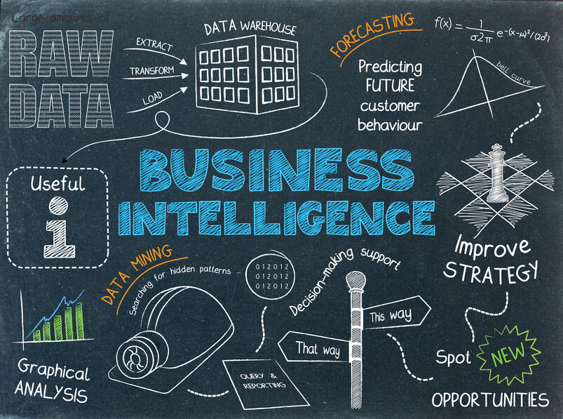
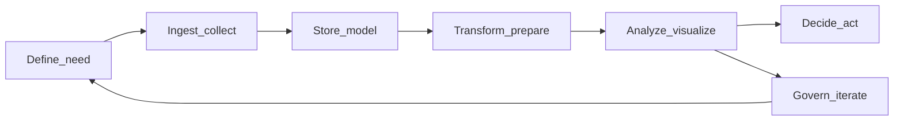

# From Data to Decisions: What BI Really Means

Most dashboards go unused.

That’s not a knock on designers or tools but it usually points to something deeper. These days, companies don’t struggle to collect data. What they struggle with is *clarity*: what actually matters, whether the numbers can be trusted, and what to do when they change.

You can have clean, well-structured data and still make bad decisions. It happens when teams aren’t aligned on the question, the definition of a metric, or the action that should follow.

A lot of organizations invest heavily in pipelines, warehouses, and visualization tools. But turning all of that into decisions that are faster, more confident, and actually aligned across teams? That’s the hard part.

This is where **Business Intelligence (BI)** comes in.

In this article, we’ll break down what BI really is, how it’s different from other roles in the data world, and what the full analytics workflow looks like in practice. If you’re new to the field—or just trying to understand what people *actually do* with data beyond the buzzwords—you’re in the right place.

---

## 2. What is Business Intelligence?

### One-line summary

**Business Intelligence (BI)** is the practice of turning raw data into **trusted, actionable information** so people can decide what to do next.

It’s less about having interesting data, and more about whether people actually trust the numbers, and know how to act on them.

### A concrete example

Imagine you’re running an e-commerce company.

Every day, you care about things like revenue, conversion rate, and whether new customers come back. But those metrics don’t live in one clean place but they’re scattered across orders, sessions, campaigns, and support tickets. It’s messy, and it’s easy for definitions to drift.

BI helps the team ask better questions, and get answers everyone can agree on:

* *Why did revenue drop last week? Was it traffic, pricing, or fulfillment?*
* *Which regions are underperforming even when traffic looks fine?*
* *Are first-time buyers coming back within 30 days? and is that improving?*

The exact business might change, but the pattern doesn’t. Every team ends up asking some version of:
*Are we growing? Are we efficient? Are customers sticking around?*

### Expanded Definition

In practice, BI usually falls into three types of work:

**Reporting** answers *what happened*. Think monthly reports, executive summaries, or the “source of truth” numbers teams rely on.

**Monitoring** answers *what’s happening right now*. Dashboards, alerts, and daily checks that help teams catch issues early.

**Exploration** digs into known questions: breaking things down by channel, region, or customer type to understand performance. It’s not open-ended research; it stays close to real business concerns.

The common thread is simple: **helping people make decisions**.
Good BI makes the state of the business easy to understand, easy to compare over time, and clearly tied to action.

### What BI is NOT

BI is not just a collection of charts.

Dashboards can help, but if people don’t agree on what a metric means, or don’t trust the data behind it, nicer visuals just make confusion faster.

It’s also not “whoever knows Excel or Tableau.” Tools matter, but they’re just tools. The hard parts are things like:

* agreeing on definitions
* deciding ownership
* keeping data fresh
* handling the moment someone says, *“I don’t trust this number”*

And BI isn’t about running queries for the sake of it. Queries should answer real questions. Otherwise, you end up with fast answers to the wrong problems.

At its best, BI is a **system of people, processes, and tools** working together:

* people who define and maintain metrics
* systems that keep data reliable
* and decision-makers who actually use it

### Typical outputs

BI work usually shows up in a few familiar forms:

* **Dashboards and scheduled reports** for recurring decisions
* **KPI packs** used in reviews and planning
* **Ad hoc analysis** when something unexpected happens
* **Data models / semantic layers** that quietly ensure “revenue” or “active users” mean the same thing everywhere

None of these are valuable on their own. They matter when they reduce debate about the numbers, and help teams move faster toward decisions.

---

## 3. BI vs Data Science vs Data Engineering

### One-line summary

**BI, data science, and data engineering** all work with the same data, but they focus on different problems.

* BI focuses on **clarity** for day-to-day decisions
* Data science focuses on **understanding and prediction**
* Data engineering focuses on **reliability and scale**

Mixing them up isn’t really “wrong”, but it *does* lead to planning problems. You end up building the wrong thing, for the wrong people, at the wrong time.

### Comparison table

This table is intentionally simplified. In real teams, roles overlap a lot. But each field usually has a **default question** it cares about most:

| Lens                 | BI                            | Data Science             | Data Engineering                    |
| -------------------- | ----------------------------- | ------------------------ | ----------------------------------- |
| **Primary question** | What happened / is happening? | What will happen / why?  | How do we reliably move/store data? |
| **Typical outputs**  | Dashboards, reports           | Models, experiments      | Pipelines, infrastructure           |
| **Time horizon**     | Present / recent past         | Future / deeper patterns | Continuous                          |
| **Audience**         | Business users                | Product / research       | Engineers                           |

### Role overlap

In smaller companies, one person often does everything: data ingestion, modeling, dashboards, maybe even some forecasting. The title might just be “data analyst,” but the real job is: *whatever keeps the business from flying blind.*

As teams grow, things start to **specialize**. Reliability work, modeling, and business reporting get split up so they’re not competing for the same time and attention.

That’s where hybrid roles come in.

For example, an **analytics engineer** (the exact title varies) usually sits between **data engineering** and **BI**. They focus on building clean transformations, testing data, and defining metrics so dashboards stay consistent, and analysts can build on top without second-guessing everything.

They’re not “the middle of everything,” but they’re a good example of how real teams blur the lines in a healthy way.

Part of the confusion comes from how loosely these terms are used.

Job descriptions often list the same skills (“SQL,” “Python,” “modeling,” “stakeholders”) even though the day-to-day work can be very different. Titles drift internally too: “analyst” might mean reporting, experimentation, or even pipeline work depending on the company.

On top of that, tools and vendors often market themselves as “end-to-end analytics platforms,” which sometimes helps, but also blurs the boundaries even more.

A simple way to cut through the noise is to ask:

> **What’s the main problem we’re trying to solve?**

* Can’t explain what already happened? → BI
* Need to predict or understand deeper patterns? → Data science
* Data is unreliable or doesn’t show up? → Data engineering

That question usually points you in the right direction, even if, in practice, one person ends up wearing two hats on the same day.

### 🧠 Key takeaway

If the titles start to feel confusing, here’s a simple way to think about it:

* **BI** → understanding and monitoring the business today
* **Data science** → predicting, explaining, and exploring patterns
* **Data engineering** → making sure data actually arrives, works, and scales

There’s no hierarchy here, just a **division of labor**. Each role reduces a different kind of risk.

---

## 4. The end-to-end analytics workflow

### One-line summary

BI isn’t a single step, but it’s a **loop** that connects **questions → data → decisions**, and then feeds what you learn back into the next question.

If you only focus on the middle (charts, SQL, dashboards), it’s easy to wonder why “insights” rarely change anything.

### Visual flow

Read this left to right as the *happy path*: define what you need, collect the data, store it, shape it into metrics, explore it, then decide what to do.

But the loop is the important part.
**Governance comes after use**, because trust issues only show up when people rely on the data. And those issues usually send you all the way back to redefining the original question.

A shorter version of the flow is still useful, as long as you don’t confuse it with the full picture:

**Raw data → clean data → metrics → views (dashboards, reports) → decisions**

Each step sounds simple, but hides real complexity:

* Who decides what “clean” means?
* What time granularity is the source of truth?
* Do different teams mean the same thing when they say “revenue”?
* What happens when the dashboard says one thing, but reality says another?

Think of this model as the **spine**. The real work happens in the details around it.

### Stages

1. **Define the need**
   Start with the decision, not the data.
   What question are we answering? Who is it for? When is it needed? What would we *do differently* depending on the answer?

   Be explicit about KPIs and stakeholders. This is where many efforts quietly fail—vague questions lead to a lot of work, but no real alignment.
   If the question isn’t clear, it’s worth slowing down here.

2. **Ingest / collect**
   Figure out where the data comes from (apps, events, spreadsheets, third parties), how often it needs to update, and what “fresh enough” actually means.

   This is also about contracts:

   * Who can change schemas?
   * How do systems connect (IDs, keys)?
   * What happens when data is late or broken?

3. **Store / model**
   Land the data somewhere reliable—a warehouse, lake, or hybrid, so it can be queried consistently.

   At a high level:

   * **Facts** = things that happened (orders, clicks)
   * **Dimensions** = context (customer, product, date)

   Modeling isn’t just structure but it’s what keeps the same metric from meaning different things in different places.

4. **Transform / prepare**
   Clean the data, apply business logic, and handle real-world messiness (refunds, returns, currency changes).

   This is where **trusted metrics** are built:

   * clear definitions
   * tested transformations
   * agreed edge cases

   A common failure: every team defines things slightly differently. Locally correct—but globally inconsistent.

5. **Analyze / visualize**
   Explore and communicate what’s happening:

   * quick analysis for investigations
   * dashboards for monitoring
   * structured narratives for reviews

   The goal isn’t more charts but it’s **clear, defensible evidence**.

6. **Decide / act**
   Turn insight into action: pricing changes, staffing adjustments, inventory decisions, experiments.

   This is where many workflows break. If no one owns the outcome, or nothing on the calendar changes when metrics move, then the analysis doesn’t go anywhere.

7. **Govern / iterate**
   Maintain the system: access control, documentation, lineage, and quality checks.

   Governance isn’t just process but it’s how you learn:

   * which metrics were wrong
   * which assumptions broke
   * which questions need to be reframed

   And then feed that back into the next cycle.

### Key insight

Treat this as a **loop**, not a one-way pipeline.

Decisions create new questions.
Usage reveals trust issues.
Failures force better definitions.

Dashboards are just one checkpoint along the way.

> BI is less about building dashboards, and more about keeping a reliable loop between questions, data, and decisions.

---

## 5. What makes BI hard?

BI is hard less because SQL is difficult, and more because organizations are.

A few patterns show up again and again:

**Ambiguous metric definitions**
Everyone says “revenue,” but they don’t always mean the same thing.

One table includes tax, another excludes refunds, a third tracks bookings instead of actual cash. Until definitions are explicit, documented, and tested, these debates look technical, but they’re really about alignment.

The question *“what exactly is revenue, for this decision, right now?”* isn’t overthinking.
It’s the work.

**Multiple sources that disagree**
CRM, billing, and product analytics almost never line up perfectly.

Resolving that gap takes judgment:

* which source is the source of truth (and for what)
* how identities are matched across systems
* what to do when data is late or incomplete

Without clear rules, teams default to whatever dashboard is easiest to access, which is rarely the most accurate.

**Misalignment between stakeholders**
Different groups want different things:

* leaders want confidence
* operators want detail
* finance wants auditability
* engineers want stability

BI sits right in the middle of all of this. When expectations, timelines, or definitions aren’t aligned, the result isn’t clarity but it’s a pile of disconnected outputs.

**Insights that never become decisions**
A chart can be completely correct, and still useless.

If no one owns the next step, if incentives discourage change, or if meetings end with *“that’s interesting”* instead of *“here’s what we’ll do,”* the work stops short.

The hardest part of BI often isn’t the analysis.
It’s getting from evidence to action.

---

## 6. Recap

**Business Intelligence** is about turning data into **trusted, actionable information**.

In practice, that means:

* reporting what happened
* monitoring what’s happening now
* exploring known questions

And doing all of that through a combination of **people, process, and tools**, not dashboards alone.

It sits alongside:

* **data science**, which focuses on prediction and deeper analysis
* **data engineering**, which focuses on reliable data systems

The boundaries blur in real teams, but the goals are different.

And most importantly, BI is a **loop**:
from defining the need → collecting and shaping data → analyzing → deciding → and then back again.

---

If the opening line about unused dashboards felt a bit cynical, it’s meant to be a challenge.

Clarity *is* possible, but it doesn’t come from better charts alone. It comes from:

* shared definitions
* honest handling of messy data
* and tying metrics to decisions someone actually owns

That’s what “data-driven” is supposed to mean.
