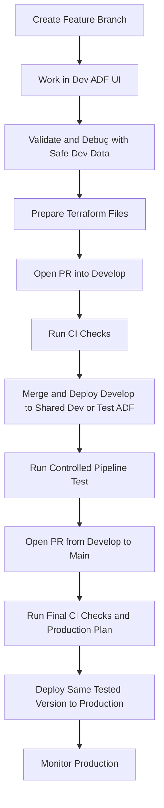

# Why CI/CD Feels Different in Data Engineering

As a software developer, I learned to test code on my computer before opening a pull request (PR). This process feels different when working with Azure Data Factory (ADF).

Assume a team uses ADF to build pipelines and Terraform to deploy them.

The team follows a process like this:

1. A developer creates or changes a pipeline in the ADF visual editor.
2. The developer selects **Validate** and **Debug** to check the pipeline.
3. ADF saves the pipeline definition as JSON files.
4. The developer prepares those files for Terraform and opens a pull request.
5. After approval, an automated process runs Terraform to update ADF.

At first, this process looks similar to application development. However, the surprising part is that Debug is a real run. It can read, copy, change, or delete real data.

This creates two important questions:

1. How can developers safely test an ADF pipeline without affecting production data?
2. How can a team trust a pull request when the files being reviewed are not exactly the same format that was tested in ADF?

This post explains why these problems happen and how a practical CI/CD process can manage them.

## A Safer Workflow

The answer is not to rely on one perfect test. A reliable process uses several smaller checks, with each one answering a different question.

For a team that uses a shared `develop` branch before production, the workflow can look like this:



In this workflow, `develop` is the branch used to combine and test changes before they reach `main`. The `main` branch represents the version approved for production.

This is a practical approach when the team wants a clear testing stage between individual feature work and production. It works best when changes enter `develop` in small groups and the team knows exactly which `develop` version passed testing.

The approach becomes less reliable when many unrelated changes are continuously merged into `develop`. In that situation, it can become difficult to know which changes were tested together and which version is ready for production.

### Step 1: Build on a Feature Branch and Debug Safely

The developer creates a feature branch, which is a temporary Git branch used for one change, and selects that branch while working in the development ADF user interface.

The developer uses ADF Validate and Debug with development connections and safe test data. Inputs should be small and clearly chosen so the test does not process more data than necessary.

Where possible, a pipeline should also be safe to run again after a failure. For example, rerunning it should not create duplicate records.

### Step 2: Prepare the Terraform Files and Open a PR into Develop

After the pipeline works in ADF Debug, the developer prepares the ADF JSON files for Terraform and opens a pull request from the feature branch into `develop`.

This pull request gives the team a chance to review both the pipeline change and the Terraform files that will actually be deployed.

### Step 3: Run CI Checks

When the developer opens a pull request, CI runs checks that do not require changing production.

These checks can include JSON validation, `terraform fmt`, `terraform validate`, and `terraform plan`.

In plain language, these checks confirm that the files are correctly structured, Terraform understands them, and reviewers can see what Terraform expects to change.

This step catches formatting, configuration, and deployment problems. It does not replace a real pipeline run.

### Step 4: Merge into Develop and Deploy to Shared Dev or Test

After the pull request passes its checks and is approved, merge it into `develop`. The CI/CD process then deploys the `develop` version to a shared Dev or Test ADF environment.

This is important because it tests the result after ADF files have been prepared and deployed through Terraform. It can reveal missing settings, incorrect permissions, broken connections, or conversion mistakes.

The feature-branch ADF and the shared testing ADF can be the same setup for a small team. For a larger team, a separate shared Test ADF is safer because deploying `develop` will not interrupt developers who are still debugging feature branches.

The team should not rebuild or manually recreate the pipeline after review. Otherwise, the deployed version may be different from the version that reviewers approved.

### Step 5: Run a Controlled Test and Check the Data

A pipeline run marked as successful only means that ADF completed all activities without reporting an error. It does not guarantee that the resulting data is correct.

After deployment, run a smoke test or controlled pipeline test. A smoke test is a small test that checks whether the most important parts work after deployment.

The test should use known inputs and check results such as:

- Were the expected records written?
- Is the row count reasonable?
- Are important fields filled in?
- Were duplicate records created?
- Did the pipeline write only to the intended development location?
- Does running the same input again produce the expected result?

These are data quality checks. They confirm that the pipeline produced useful and trustworthy data, not merely that it finished.

### Step 6: Open a PR from Develop to Main

Once the deployed `develop` version passes its tests, open a pull request from `develop` into `main`.

This pull request is the final review before production. It should clearly show the version that passed the shared Dev or Test checks.

CI should run again for this pull request. It should also create a Terraform plan for production so reviewers can see how production-specific settings will change before approving the deployment.

The main risk with this approach is that another feature may be merged into `develop` after testing but before the production pull request is completed. In that case, the version going to production is no longer the same version that passed testing.

Teams can manage this risk by briefly pausing merges into `develop` during a release, testing the latest `develop` version again whenever it changes, or marking the tested version with a Git tag or commit number and deploying that exact version.

### Step 7: Deploy the Same Tested Version to Production

After the final pull request is approved, deploy the same tested version to production.

This is sometimes called promotion. Promotion means taking a version that passed testing and deploying it to the next environment without changing it.

Environment-specific details, such as database names and passwords, will be different. The pipeline logic and Terraform files should remain the same as the tested version. Teams often record the tested Git commit number so they can confirm which version is being released.

A clear summary of this workflow is:

```text
feature branch
  -> build, Validate, and Debug in Dev ADF
  -> pull request into develop
  -> CI checks
  -> deploy develop to shared Dev or Test ADF
  -> controlled test and data checks
  -> pull request from develop to main
  -> final CI checks and production Terraform plan
  -> deploy the same tested version to production
```

The branch names alone do not make the process safe. The real protections are separate environments, safe test data, automated checks, and proof that production receives the same version that passed testing.

### Step 8: Monitor Production and Prepare for Problems

Testing reduces risk, but production can still behave differently because it has more data, different permissions, and real schedules.

After deployment, the team should monitor the first runs and confirm that expected data arrives on time.

The team also needs a recovery plan. Deploying the previous pipeline version may fix the code, but it does not automatically repair incorrect data that has already been written.

A recovery plan may include stopping schedules, restoring data, rerunning selected inputs, or running a separate repair pipeline.

## Final Thoughts

CI/CD in data engineering has the same purpose as CI/CD in software development: make changes small, review them, test them, and release them safely.

The main difference is what it means for a change to work.

An ADF pipeline does not work merely because its definition is valid or because Terraform deployed it successfully. It works when it runs safely, uses the correct connections, and produces the expected data.

The pull request should not be the first time anyone tests the pipeline logic, and production should not be the first place where the reviewed version runs.

A reliable process tests the draft safely, checks the pull request into `develop`, deploys `develop` to a non-production environment, verifies the resulting data, and then moves that same tested version through `main` to production.

That is how CI/CD helps a data team deploy not only a working pipeline, but a pipeline people can trust.

## Official References

- [Continuous integration and delivery in Azure Data Factory](https://learn.microsoft.com/azure/data-factory/continuous-integration-delivery)
- [Automated publishing for Azure Data Factory CI/CD](https://learn.microsoft.com/azure/data-factory/continuous-integration-delivery-improvements)
- [ADF CI/CD pre- and post-deployment scripts](https://learn.microsoft.com/azure/data-factory/continuous-integration-delivery-sample-script)
- [Iterative development and debugging in Azure Data Factory](https://learn.microsoft.com/azure/data-factory/iterative-development-debugging)
- [Applying DataOps in Azure Data Factory](https://learn.microsoft.com/azure/data-factory/apply-dataops)
- [Terraform `azurerm_data_factory_pipeline` resource](https://registry.terraform.io/providers/hashicorp/azurerm/latest/docs/resources/data_factory_pipeline)
