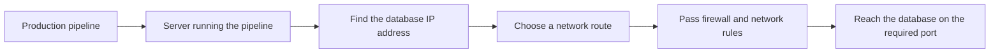

# Why Can My Laptop Connect but the Pipeline Cannot?

## The Situation

A data team is building a pipeline that copies customer records from a partner's database every night. During development, an engineer connects to the database from a laptop, runs a query, and confirms that the username and password work. The team then configures the same database address and credentials in the production pipeline, but the pipeline cannot connect.

At first, this is confusing. The database is running, the credentials are correct, and the engineer has already proved that a connection is possible. Why would the pipeline fail?

The reason is that the laptop and the pipeline are not connecting from the same place. The laptop may be connected to the partner's network through a company VPN. The production pipeline may run from a server in Azure called a Self-hosted Integration Runtime, or SHIR. The partner's firewall may allow connections from the company VPN but block connections from the Azure server.

The networking team asks the data team to submit an FPR, which in this company means a firewall permission request. The request must state where the connection will come from, where it needs to go, and which type of traffic should be allowed. The data team now needs to understand source IP addresses, destination IP addresses, ports, subnets, and network routes before the pipeline can move any data.

This is a common production lesson: proving that one computer can reach a system does not prove that another computer can reach it.

## Why It Is Not Simple

People often describe a database connection as though the application talks directly to the database. In reality, the request passes through several network steps. Each step can send the request to the wrong place or block it.

The laptop and the production runtime may differ at every step. They may receive different IP addresses for the same database name, use different routes, pass through different firewalls, or appear to the partner as different source IP addresses. Even when both connections reach the database, they may use different identities and receive different permissions.

That is why the useful question is not simply, "Can the database be reached?" The useful question is, "Can this specific runtime reach this specific database address on this specific port through the approved network path?"

## Build the Mental Model

### A Connection Needs a Source, a Destination, and a Port

An **IP address** identifies a device or network interface so traffic can be sent to it. It plays a role similar to a street address: without a destination address, the network does not know where to deliver the request.

For this pipeline, the **source IP** identifies where the connection comes from, and the **destination IP** identifies the database it is trying to reach. A firewall uses these addresses to decide whether the traffic should be allowed.

A **port** identifies the service the client wants to use on the destination. One server can provide several services through the same IP address, so the port helps the server direct the request to the correct one. **TCP** is a common set of rules for creating a reliable connection between two systems. For example, HTTPS commonly uses TCP port `443`, SFTP commonly uses TCP port `22`, and Microsoft SQL Server commonly uses TCP port `1433`.

This is why a firewall request needs more than the database name. The networking team needs enough information to create a rule such as: allow the production runtime at this source address to connect to this database address using TCP port `1433`.

### Public and Private IP Addresses

A **network-connected system** is any system that sends or receives network traffic, such as a laptop, server, database, or pipeline runtime. A system usually needs an IP address on each network it directly connects to so other systems on that network know where to send traffic.

A server inside a company network will usually have a **private IP address** that other systems in the same private network can use to reach it. If the server also needs to be reached through the public internet, it may have a public IP address directly assigned to it, or a public IP may be mapped to its private IP by a firewall, load balancer, or NAT service.

This means a system can effectively be reached through both a private address and a public address, but it does not always mean that both addresses are assigned directly to the server. In many production environments, the server knows only its private IP, while a separate network service manages the public IP and forwards approved traffic to it.

A **public IP address** is unique across the public internet and can be routed between internet-connected networks. A public address does not mean that everybody is allowed to connect to it. Firewalls can still restrict which source addresses and ports are accepted.

A **private IP address** is used only inside private networks, such as a home network, company network, or Azure Virtual Network. Private addresses are not routed directly across the public internet.

Private addresses are needed partly because IPv4 has a limited number of addresses. IPv4 contains about 4.3 billion possible addresses, which is not enough to give every laptop, phone, server, and other connected device its own permanent public address. Private ranges can be reused independently inside different networks. For example, two companies can both have a server using `10.20.4.7` because each address exists only inside its own company's private network.

For this pipeline, the SHIR server may use its private IP when connecting to a database through a private company route. If it connects to a partner through the public internet, the partner will usually see a public IP managed by the company's NAT or firewall.

### Understanding Private IP Ranges and `/8`

An IPv4 address contains **32 bits** of information. A bit is a value that can be either `0` or `1`. The address is displayed as four numbers separated by dots, such as `10.20.4.7`, because this is easier for people to read than 32 individual bits.

The slash at the end of an address range is called **CIDR notation**. It tells us how many of the address's 32 bits identify the network. The remaining bits can change to create individual addresses inside that network.

For example, `/8` means the first 8 bits identify the network and the remaining 24 bits can vary. This creates `2^24`, or 16,777,216, possible addresses in the range. In `10.0.0.0/8`, the first number remains `10`, while the other three numbers can range from `0` to `255`.

A larger slash number leaves fewer bits available for addresses, so it describes a smaller range. A `/16` contains fewer addresses than a `/8`, and a `/32` identifies one exact IPv4 address.

Each of the four displayed numbers represents 8 bits. This makes `/8` and `/16` relatively easy to read: `/8` fixes the first number, while `/16` fixes the first two numbers. A `/12` fixes the first number and part of the second number. That is why `172.16.0.0/12` includes second numbers from `16` through `31`, rather than every address beginning with `172`.

Three IPv4 ranges are reserved for use inside private networks:

| Private range | First address | Last address | Number of addresses | Plain-language description |
|---------------|---------------|--------------|---------------------|----------------------------|
| `10.0.0.0/8` | `10.0.0.0` | `10.255.255.255` | 16,777,216 | Every address beginning with `10` |
| `172.16.0.0/12` | `172.16.0.0` | `172.31.255.255` | 1,048,576 | Addresses beginning with `172.16` through `172.31` |
| `192.168.0.0/16` | `192.168.0.0` | `192.168.255.255` | 65,536 | Every address beginning with `192.168` |

The exact ranges matter. People sometimes assume that every address beginning with `172` is private, but only addresses from `172.16.0.0` through `172.31.255.255` are private. For example, `172.15.1.5` is a public address.

In a highly restricted company, direct connections between public IP addresses may be blocked by policy. A pipeline may instead need to communicate through approved private networking, or the partner may allow only a known public address belonging to the company.

### Private Networks, VNets, and Subnets

A **private network** creates a controlled space where systems can communicate without exposing every connection to the public internet. Companies use private networks to limit access to databases, storage accounts, internal applications, and other sensitive systems.

In Azure, a private network is called a **Virtual Network**, usually shortened to **VNet**. A VNet gives Azure resources a private address space and provides a place to define routes and security controls.

A **subnet** is a smaller address range inside a VNet. It groups resources that should have similar network behavior. For example, a company may place SHIR servers in one subnet and application servers in another. This makes it possible to apply different routes and security rules to each group.

For this pipeline, knowing the SHIR subnet helps the networking team understand where the request begins. However, the address the partner sees depends on how the networks are connected. The partner may see the SHIR server's private IP over a private route, or it may see a public IP produced by NAT.

### Firewalls and Network Security Groups

A **firewall** checks network traffic against a set of rules. A rule can allow or deny traffic based on details such as the source address, destination address, port, and direction.

Large organizations often place firewalls at several boundaries. The data team's company may inspect traffic before it leaves, and the partner may inspect traffic before it reaches the database. Both sides must allow the connection.

Azure also provides **Network Security Groups**, usually shortened to **NSGs**. An NSG is a set of network rules applied to an Azure subnet or network interface. It can block the SHIR server from sending traffic even when an external firewall would otherwise accept it.

The important point is that there is rarely only one firewall to check. A connection may be allowed by the partner and still be blocked inside Azure, or allowed inside Azure and blocked by the partner.

The same CIDR notation is used when creating firewall rules. A firewall rule can approve one IP address or a range of addresses.

A `/32` identifies one exact IPv4 address. For example, `203.0.113.20/32` means only `203.0.113.20`.

A `/22` leaves 10 of the 32 bits available for individual addresses, so it covers `2^10`, or 1,024 addresses. For example, `10.20.4.0/22` includes every address from `10.20.4.0` through `10.20.7.255`.

Approving a larger range can be useful when several approved runtime servers use addresses from the same subnet. It avoids submitting a new request whenever one server is replaced. However, a larger range also allows more possible sources to use the connection. A `/22` should not be requested merely because it is convenient. The approved range should be the smallest stable range that supports the real operational need.

### Routes, VPNs, and ExpressRoute

A **route** tells the network where to send traffic next. If the destination is private, the source network needs a route that connects it to the destination network. Without that route, the request cannot arrive even if every firewall rule is correct.

A **Virtual Private Network**, or **VPN**, creates an encrypted connection between networks over the public internet. A company can use a VPN to let Azure resources communicate with an on-premises or partner network through private addresses.

**ExpressRoute** is an Azure service that provides a private connection between an organization's network and Azure through a connectivity provider. It does not use the public internet for the connection and can offer more predictable performance, but it is usually more expensive and requires more setup than a VPN.

The pipeline does not need to know how every route is implemented. The team does need to know whether the database should be reached through the public internet, a VPN, ExpressRoute, or another private connection, because that decision determines which addresses and firewall rules are relevant.

### Turning the Information into a Firewall Request

A typical firewall request looks like this:

| Field | Example |
|-------|---------|
| Source | SHIR subnet `10.20.4.0/24` or NAT IP `203.0.113.20/32` |
| Destination | Partner database `198.51.100.15/32` |
| Protocol and port | TCP `1433` |
| Direction | Outbound from the runtime |
| Purpose | Nightly customer ingestion |

The source field depends on the route. If the database is reached privately, the source may be the SHIR subnet. If the connection leaves through NAT, the partner may need the public NAT IP instead.

The pipeline runtime may also need outbound HTTPS on TCP port `443` to communicate with cloud management services. For example, SHIR normally starts an outbound connection to Azure Data Factory so it can receive work. This does not automatically mean the database also uses port `443`; the database connection must use the port required by that database.

## Investigate the Problem

1. Start with the failing production runtime, not the laptop, because that is the system whose path needs to work.
2. Look up the database hostname from the runtime and record the destination IP it receives.
3. Confirm the port required by the database.
4. Identify the source address the destination will actually see, including any NAT address.
5. Confirm there is a valid public or private route between the two networks.
6. Check NSGs and firewalls on both sides for the same source, destination, and port.
7. Test whether the runtime can open a basic network connection to the destination port.
8. After the network path works, investigate encryption, credentials, and database permissions.

This order prevents the team from repeatedly changing passwords when the request cannot reach the database in the first place.

## Takeaways

- Public IPs are internet-routable; private IPs use defined internal ranges.
- A subnet segments a VNet and commonly shares routing and security controls.
- NAT translates addresses across network boundaries.
- NSGs allow or deny traffic based on network details such as addresses, ports, and direction.
- VPN uses the internet; ExpressRoute is a private dedicated connection.
- A laptop connection does not prove that a production runtime has the same DNS, route, firewall access, certificates, or permissions.

## Official References

- [RFC 1918: Address Allocation for Private Internets](https://www.rfc-editor.org/rfc/rfc1918)
- [Azure Virtual Network documentation](https://learn.microsoft.com/azure/virtual-network/virtual-networks-overview)
- [Azure Network Security Groups](https://learn.microsoft.com/azure/virtual-network/network-security-groups-overview)
- [Azure ExpressRoute introduction](https://learn.microsoft.com/azure/expressroute/expressroute-introduction)
