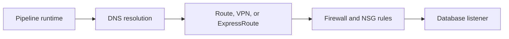

# Why Can My Laptop Connect but the Pipeline Cannot?

## The Situation

A developer can connect to a partner database from a laptop, but the production ingestion pipeline cannot. The networking team asks for an FPR, or firewall request, containing the source IP, destination IP, protocol, and port.

The developer knows the database hostname and assumes the successful laptop test proves that the database is available. It does not. The laptop and the pipeline runtime are two different clients taking two different network paths.

## Why It Is Not Simple

A connection succeeds only when every layer permits the same path:

The laptop may use a corporate VPN and an approved office egress IP. A self-hosted runtime may sit in an Azure subnet, resolve the hostname differently, and leave through another NAT address. Its identity and database permissions can also differ.

## Build the Mental Model

A **public IP** is internet-routable. A **private IP** is intended for internal networks. The RFC1918 private IPv4 ranges are:

- `10.0.0.0/8`
- `172.16.0.0/12`
- `192.168.0.0/16`

Not every address beginning with `172` is private. For example, `172.15.1.5` is outside the private range.

A **VNet** is an isolated Azure network. A **subnet** is an IP range inside a VNet where resources are placed. A **network security group (NSG)** applies stateful allow and deny rules to subnets or network interfaces. **NAT** maps one address range to another, commonly allowing private clients to share a stable public egress IP.

CIDR suffixes describe address ranges. `10.20.4.7/32` identifies one address. `10.20.4.0/22` covers 1,024 addresses, from `10.20.4.0` through `10.20.7.255`. Approving `/22` can reduce repeated firewall requests when a runtime legitimately uses that whole subnet, but it grants much broader access. The narrowest stable range should be approved.

A typical firewall request looks like this:

| Field | Example |
|-------|---------|
| Source | SHIR subnet `10.20.4.0/24` or NAT IP `203.0.113.20/32` |
| Destination | Partner database `198.51.100.15/32` |
| Protocol and port | TCP `1433` |
| Direction | Outbound from the runtime |
| Purpose | Nightly customer ingestion |

Cloud control-plane APIs commonly use outbound HTTPS on TCP `443`. HTTPS itself uses `443`; port `80` may sometimes be needed for redirects or certificate-status checks, depending on the environment.

A **VPN** creates an encrypted tunnel over the public internet. **ExpressRoute** provides a private dedicated connection to Azure, usually with more predictable bandwidth and latency.

## Investigate the Problem

1. Run DNS resolution from the pipeline runtime, not from the laptop.
2. Record the resolved destination IP and expected port.
3. Identify the runtime's actual source IP after NAT.
4. Test the TCP connection from the runtime host.
5. Check routes, VPN or ExpressRoute state, NSGs, and both firewalls.
6. Only after the network path works, check TLS and database permissions.

This sequence separates transport failures from authentication failures.

## Choose a Solution

Use a stable NAT egress IP when an external partner must allow-list a public source. Use private routing through VPN or ExpressRoute when systems should not be exposed publicly. Approve a subnet range only when all clients in that range have the same legitimate need and are governed appropriately.

Related reading: [The Private Endpoint Exists, So Why Does Connectivity Still Fail?](03-private-endpoint-connectivity.md) explains the DNS behavior of private endpoints.

## Production Checklist

- Confirm DNS, source IP after NAT, destination IP, protocol, and port.
- Test from the real runtime host.
- Check routes, NSGs, firewalls, proxies, and service listener status.
- Document why each approved IP range is required.
- Prefer stable, narrow ranges and review broad CIDR approvals regularly.
- Confirm outbound TCP `443` access required by cloud runtimes.

## Interview Takeaways

- Public IPs are internet-routable; private IPs use defined internal ranges.
- A subnet segments a VNet and commonly shares routing and security controls.
- NAT translates addresses across network boundaries.
- NSGs allow or deny network traffic at layer 3 and layer 4.
- VPN uses the internet; ExpressRoute is a private dedicated connection.
- A laptop connection does not prove that a production runtime has the same DNS, route, firewall access, certificates, or permissions.

## Official References

- [RFC 1918: Address Allocation for Private Internets](https://www.rfc-editor.org/rfc/rfc1918)
- [Azure Virtual Network documentation](https://learn.microsoft.com/azure/virtual-network/virtual-networks-overview)
- [Azure Network Security Groups](https://learn.microsoft.com/azure/virtual-network/network-security-groups-overview)
- [Azure ExpressRoute introduction](https://learn.microsoft.com/azure/expressroute/expressroute-introduction)
