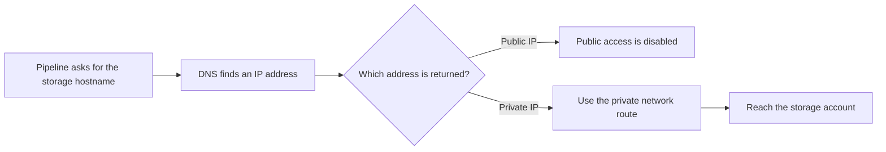

# The Private Endpoint Exists, So Why Does Connectivity Still Fail?

## The Situation

A data team stores incoming files in an Azure Storage account. At first, the storage account is available through a public network address. Access is still protected by identity and firewall rules, but traffic reaches the service through its public endpoint.

The company's security policy changes. Production services should no longer connect to the storage account through a public address, so the platform team creates a private endpoint. The private endpoint gives the storage account a private IP address inside the company's Azure Virtual Network, or VNet. After a successful test from one server, the team disables public network access to the storage account.

Soon afterward, the ingestion pipeline stops working. The private endpoint appears healthy in the Azure portal, and the storage account itself is available. A developer suggests changing the firewall rules, but another engineer checks the pipeline server and discovers that the storage account's hostname still resolves to its old public IP address.

The pipeline is asking the public entrance for access after that entrance has been closed. The new private entrance exists, but the pipeline does not know how to find it.

This is why creating a private endpoint is not only a networking task. The team must also make sure that every approved client translates the service's normal hostname into the new private IP address.

## Why It Is Not Simple

A private endpoint changes how clients are expected to reach a service. Before the change, the storage hostname points clients toward a public address. After the change, approved clients need the same hostname to lead them toward a private address.

The private endpoint can be correctly created and approved while the pipeline still fails. The pipeline also needs correct name resolution, a route to the private endpoint, network rules that permit the traffic, and permission to use the storage account.

This creates an important troubleshooting lesson: a resource showing as healthy in a cloud portal proves only that the resource itself was created successfully. It does not prove that every client can find or reach it.

## Build the Mental Model

### Why Applications Use Names Instead of IP Addresses

People usually open a website by entering a name such as `www.example.com`, not by entering the server's numeric IP address. Applications work the same way. A pipeline may be configured with a storage hostname such as `companydata.blob.core.windows.net`.

A **hostname** is a readable name used to identify a network service. A **Fully Qualified Domain Name**, usually shortened to **FQDN**, is the complete hostname, including its domain. In this example, `companydata.blob.core.windows.net` is the FQDN.

Applications use hostnames because the service's IP address may change and because security certificates are normally issued for names rather than raw IP addresses. Keeping the normal hostname also allows Azure to direct the request to the correct storage account.

### DNS Is the Directory That Finds the Address

**Domain Name System**, or **DNS**, translates a hostname into an IP address. This translation is called **DNS resolution**.

DNS can be compared to looking up a business in a directory. The application knows the name of the service it wants, and DNS returns the address it should contact. The application then sends its network traffic to that address.

This step is critical after creating a private endpoint. If DNS returns the storage account's public IP, the pipeline tries the public route. If public access has been disabled, the request fails. If DNS returns the private endpoint's IP, the pipeline can attempt the private route.

DNS answers can differ depending on where the request comes from. A laptop outside the company network may correctly receive the public address, while a production server inside the Azure VNet should receive the private address. This is why DNS must be tested from the system that is actually failing.

### What a Public Endpoint Means

An **endpoint** is an address through which a service can be reached. An Azure service's **public endpoint** is reachable through a public IP address. Public does not mean anonymous: the service can still require authentication and restrict which networks are allowed.

Before the change in this story, the pipeline used the storage account's public endpoint. The network could route the request to the public address, and the storage account decided whether to accept it.

Disabling public access closes that route into the service. Any client that still receives the public address from DNS will fail, even if its identity and permissions are correct.

### What a Private Endpoint Changes

A **private endpoint** is a private network connection with its own private IP address inside a VNet. It connects that private address to one specific Azure service, such as one storage account. Azure calls the underlying capability that makes this connection possible **Private Link**.

For example, the storage account may receive the private endpoint address `10.30.5.8`. Approved systems that can reach the VNet should connect to that address when they use the storage account's normal hostname.

The private endpoint gives the service a private entrance, but it does not automatically update every client's DNS or create a route from every company network. Each client still needs:

- DNS that returns the private endpoint IP
- A network route to the VNet and subnet containing the private endpoint
- Network rules that allow the required traffic
- An approved private endpoint connection
- An identity with permission to use the service

This separation explains why a private endpoint can show as healthy while an application remains unable to connect.

### How Private DNS Directs Clients to the Private Endpoint

A **DNS zone** stores DNS records for part of the naming system. A **private DNS zone** provides DNS answers only to the private networks linked to it.

When private DNS is configured for the storage account, Azure uses DNS records so clients inside the linked VNet resolve the normal storage hostname to the private endpoint IP. The application continues using `companydata.blob.core.windows.net`; it does not need to be rewritten to use `10.30.5.8`.

Keeping the normal hostname matters because the encrypted connection uses a security certificate to confirm the service's identity. This protection is called **Transport Layer Security**, or **TLS**. TLS certificates are normally issued for hostnames, so connecting directly to the private IP can cause the identity check to fail and can prevent Azure from identifying the intended service correctly.

The private DNS zone must be linked to each VNet that needs to use it. If clients are on-premises or in another network, the organization's DNS servers may need **conditional forwarding**. Conditional forwarding means sending DNS questions for a particular domain to the DNS service that knows the correct private answer.

### Private Endpoints Do Not Replace Routes or Security Rules

Correct DNS tells the client which address to use, but the network must still know how to reach that address. A server in the same VNet may already have a route. A server in another VNet may need **network peering**, which connects two VNets so they can route traffic between each other. A server running in the company's own facilities may need a private network connection to Azure, such as a VPN or ExpressRoute.

Firewalls, **Network Security Groups (NSGs)**, custom routing rules, and proxies can still block or redirect the traffic. An NSG is a set of Azure rules that allows or denies network traffic for a subnet or network interface. These controls should be checked only after confirming that DNS returned the intended private IP; otherwise, the team may spend hours changing network rules for the wrong destination. Azure calls custom routing rules **user-defined routes**.

### Service Endpoints and Private Endpoints Solve Different Problems

A **service endpoint** allows a supported Azure service to recognize traffic as coming from an approved VNet subnet. Traffic travels over the Azure network, but clients still connect to the service's public endpoint and the service still has a public IP address.

A **private endpoint** gives one specific service instance a private IP address inside the VNet. Clients connect through that private address, and the service's public access can be disabled.

A service endpoint can be simpler when the goal is to restrict a service so it accepts traffic only from approved Azure subnets. A private endpoint is useful when policy requires private IP connectivity, when public access must be disabled, or when the service needs to be reached privately from connected networks.

Neither option automatically grants permission to read data. Network access answers, "Can the request reach the service?" Identity and access permissions answer, "Is this caller allowed to perform this action?"

## Investigate the Problem

Work from name resolution toward the service:

1. Start from the failing pipeline server or runtime, because DNS and routes may differ between networks.
2. Resolve the exact service hostname used by the application.
3. Confirm that DNS returns the intended private endpoint IP rather than the public IP.
4. Confirm that the private endpoint connection is approved for the correct service.
5. Confirm that the client network has a route to the VNet and subnet containing the private endpoint.
6. Check NSGs, custom routing rules, firewalls, and proxies for the private destination.
7. Test whether the service's required network port can be reached.
8. Connect using the original service hostname so TLS can validate the expected name.
9. Confirm that the pipeline's identity has permission to perform the requested operation.

Common failures include a private DNS zone that is not linked to the client's VNet, a company DNS server that does not forward the request correctly, an unapproved private endpoint, a blocked route, or an application that has cached the old public DNS result.

## Choose a Solution

Use a service endpoint when the main requirement is to allow an Azure service to accept traffic only from approved VNet subnets and using the service's public endpoint is acceptable.

Use a private endpoint when the service must have a private IP inside the VNet, public access must be disabled, or connected private networks must reach the service without using its public endpoint.

Treat DNS, routing, and client testing as part of the private endpoint deployment. Before disabling public access, test from every important network and runtime that will need the private path. A staged change is safer than creating the endpoint and immediately closing the old path.

Related reading: [Why Can My Laptop Connect but the Pipeline Cannot?](02-laptop-connects-pipeline-cannot.md) covers the wider network path.

## Takeaways

- DNS maps hostnames to IP addresses.
- Private endpoints normally require DNS integration so service hostnames resolve to private rather than public IPs.
- Service endpoints secure access from a subnet while the service retains a public endpoint.
- Private endpoints place a service-specific private IP in the VNet.
- A healthy private endpoint does not prove DNS, routing, NSGs, or application configuration are correct.

## Official References

- [Azure Private Endpoint](https://learn.microsoft.com/azure/private-link/private-endpoint-overview)
- [Azure Private Endpoint DNS configuration](https://learn.microsoft.com/azure/private-link/private-endpoint-dns)
- [Azure Virtual Network service endpoints](https://learn.microsoft.com/azure/virtual-network/virtual-network-service-endpoints-overview)
