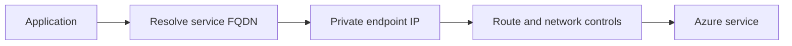

# The Private Endpoint Exists, So Why Does Connectivity Still Fail?

## The Situation

A team creates a private endpoint for a storage service and disables public access. The application immediately stops connecting. The endpoint appears healthy in the Azure portal, so the team assumes an NSG must be blocking it.

The first test reveals the application still resolves the storage hostname to its public IP.

## Why It Is Not Simple

A private endpoint does not merely add a route. It gives a service a private IP in a VNet, and clients must resolve the service hostname to that IP.

If DNS returns the public IP, the client still attempts the public path. Once public access is disabled, that attempt fails even though the private endpoint itself is valid.

## Build the Mental Model

**DNS resolution** translates a fully qualified domain name, or FQDN, into an IP address. Applications normally connect by hostname because service IPs can change and TLS certificates validate hostnames.

A **service endpoint** lets a subnet reach a supported Azure service over the Azure backbone and allows the service to trust that subnet. The service still uses its public endpoint.

A **private endpoint** maps a specific service instance to a private IP in the consumer VNet through Azure Private Link. It supports a stronger private-access model, but requires correct DNS and endpoint lifecycle management.

Private DNS integration usually creates or links a private DNS zone so the normal service hostname ultimately resolves to the private endpoint address. On-premises clients may require conditional forwarding to Azure DNS.

## Investigate the Problem

Work from name resolution toward the service:

1. Resolve the exact FQDN from the failing client.
2. Confirm the result is the intended private IP.
3. Confirm the private endpoint connection is approved.
4. Confirm the client has a route to the endpoint subnet.
5. Check NSGs, user-defined routes, firewalls, and proxies.
6. Test the required TCP port.
7. Validate TLS using the original service hostname, not the private IP.
8. Confirm the service permits the requested operation and identity.

Common failures include an unlinked private DNS zone, a wrong FQDN, an unapproved endpoint, blocked routing, and an application with cached public DNS results.

## Choose a Solution

Use service endpoints when subnet-restricted access to a supported Azure service is sufficient and public endpoint semantics are acceptable. Use private endpoints when the service needs a private VNet address or public access must be disabled.

Treat DNS as part of the private endpoint deployment. Validate from every network that needs access before disabling the public path.

Related reading: [Why Can My Laptop Connect but the Pipeline Cannot?](02-laptop-connects-pipeline-cannot.md) covers the wider network path.

## Production Checklist

- Inventory every client network before changing public access.
- Plan private DNS zones, links, forwarding, and record ownership.
- Verify endpoint approval and the selected service subresource.
- Test FQDN resolution and TCP connectivity from real clients.
- Preserve the service hostname for TLS validation.
- Define rollback steps before disabling public access.

## Interview Takeaways

- DNS maps hostnames to IP addresses.
- Private endpoints normally require DNS integration so service hostnames resolve to private rather than public IPs.
- Service endpoints secure access from a subnet while the service retains a public endpoint.
- Private endpoints place a service-specific private IP in the VNet.
- A healthy private endpoint does not prove DNS, routing, NSGs, or application configuration are correct.

## Official References

- [Azure Private Endpoint](https://learn.microsoft.com/azure/private-link/private-endpoint-overview)
- [Azure Private Endpoint DNS configuration](https://learn.microsoft.com/azure/private-link/private-endpoint-dns)
- [Azure Virtual Network service endpoints](https://learn.microsoft.com/azure/virtual-network/virtual-network-service-endpoints-overview)
