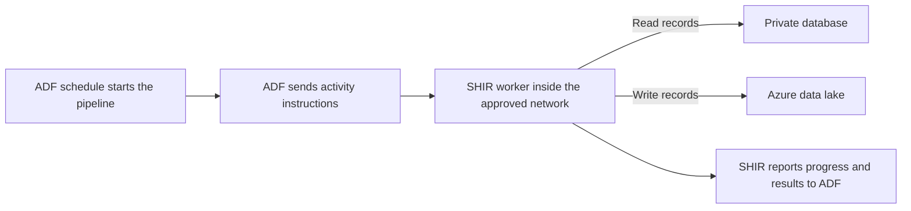

# Why Does ADF Need a Machine in the Middle?

## The Situation

A data team uses Azure Data Factory (ADF) to build a pipeline that copies sales records into an Azure data lake every night. The source is a SQL database running inside the company's private network. Employees can reach the database when they are connected to the company network, but it cannot be reached through the public internet.

The team creates the pipeline in ADF and enters the database hostname and credentials. The first connection test fails. ADF is running in Azure, while the database accepts connections only from systems inside the private company network. The database team will not create a public address or open an inbound firewall rule because the database contains sensitive production data.

The platform team proposes installing a small ADF component called a **Self-hosted Integration Runtime**, usually shortened to **SHIR**, on a Windows server that can reach the database. The server could run inside the company's own facilities or on an Azure Virtual Machine connected to the private network.

At first, this can sound unnecessary. If ADF owns the pipeline, why does it need another machine to copy the data? Is ADF not already the machine running the pipeline?

The answer is that ADF coordinates the work, but another machine provides the processing power and performs the work. The SHIR server becomes the worker that can reach the private database without making that database public.

## Why It Is Not Simple

Cloud services often hide the machines that perform their work. A user sees an ADF pipeline in the Azure portal, selects **Run**, and watches its status. This makes it natural to imagine that ADF itself opens the database connection and copies every row.

In practice, two different kinds of work are happening. ADF decides what should run and when it should run. An **integration runtime** performs the activity from a network location that can reach the required systems.

This separation creates several questions that do not appear in a simple pipeline diagram. Which component actually moves the data? Which network must it run inside? How does ADF send instructions without opening the private network to inbound internet traffic? What happens when the worker becomes busy or fails?

## Build the Mental Model

### ADF Describes and Coordinates the Work

**Azure Data Factory** is a managed Azure service for data integration and orchestration. Data integration means bringing data together from different systems. **Orchestration** means coordinating a sequence of work: deciding which activity runs first, when it runs, what happens after it succeeds, and what should happen if it fails.

An ADF **pipeline** is a definition of a workflow. It may say, "Every night, copy new sales records from this database into this data lake, then start a transformation." Each individual step is called an **activity**.

ADF stores the pipeline definition, starts activities at scheduled times or in response to defined events, tracks their status, waits for required earlier activities, and records results. These responsibilities are sometimes called the **control plane** because they control and coordinate the work.

The control plane is important, but it does not always perform the actual data transfer. The part that reads data from the source and writes it to the destination is called the **data plane**.

For this pipeline, ADF controls the run, while an integration runtime performs the data-plane work of connecting to the SQL database, reading records, and writing them to the data lake.

### An Integration Runtime Is the Worker

An **integration runtime**, or **IR**, is the processing environment ADF uses to perform activities. It provides the machines, network access, and software needed to do the work. A useful way to think about it is that ADF is the coordinator and the integration runtime is the worker.

The worker needs more than processing power. It also needs a valid network path to the source and destination, the required software drivers, and an approved account or credentials with permission to access both systems.

Choosing an integration runtime is therefore partly a networking decision. A perfectly configured worker cannot read a database it cannot reach.

### Azure Integration Runtime Works for Reachable Cloud Services

The **Azure Integration Runtime**, often shortened to **Azure IR**, is managed by Microsoft. The data team does not install or maintain its underlying servers.

Azure IR is a good fit when the source and destination can be reached from Microsoft's managed Azure environment. For example, it can copy data between supported cloud services that expose approved public endpoints or have private network connections configured for the runtime.

Azure IR is convenient because Microsoft manages its availability and maintenance. However, it is not automatically inside the company's private network. If a database can be reached only from that private network, Azure IR may have no route to it.

### Self-hosted Integration Runtime Works from a Network You Control

The **Self-hosted Integration Runtime**, or **SHIR**, is software installed on a Windows machine managed by the company. That machine can be an Azure Virtual Machine, commonly called a **VM**, or a physical or virtual server running in the company's own facilities. A virtual machine is a software-based computer that runs on shared physical hardware but behaves like an independent server.

The SHIR performs ADF activities from the network where its machine is located. If the SHIR server can reach the private SQL database, ADF can assign the copy activity to SHIR and use that approved network path.

This is why SHIR acts as a machine in the middle. ADF can coordinate the pipeline from Azure without connecting directly into the private network. SHIR receives the work, connects to the database from inside the approved network, moves the data, and reports the result to ADF.

The SHIR machine may also be needed when a source requires a custom database driver or other software that is not available in the Microsoft-managed runtime. A **driver** is software that allows one system to communicate with a particular type of database or service.

### SHIR Usually Starts the Connection to ADF

Opening an inbound firewall rule would allow an external system to begin connections into the private network. Security teams often avoid this because it increases the ways an internal server can be reached.

SHIR is designed so the worker normally starts an **outbound** encrypted connection to required Azure services, commonly using HTTPS on TCP port `443`. HTTPS is the encrypted communication method widely used by websites and cloud services, and port `443` identifies that service on the destination. Outbound means the connection begins from the SHIR machine and leaves the private network. Because SHIR creates the connection, ADF can use that established communication path to assign work and receive status updates without directly opening an inbound connection to the server.

This does not mean SHIR needs access only to Azure. The SHIR machine must also be able to connect to the source and destination systems used by its activities. For this story, it needs a network path to the private database and a path to the Azure data lake.

### SHIR Moves Data but Is Not a Data Store

SHIR performs the transfer, but it is not intended to permanently store the pipeline's data. It may hold data temporarily on disk or in memory while copying it, but permanent copies belong in the source, destination, or another approved storage area.

If the SHIR machine fails, the team should replace or recover the worker rather than attempt to recover business data from its temporary files. Sensitive temporary data should still be protected, and the machine needs enough disk space for the activities it performs.

### One SHIR Installation Is a Node, and Several Nodes Form a Cluster

A machine registered as part of a SHIR setup is called a **node**. Several nodes can be registered together to form a **cluster**, which is a group of workers registered to the same SHIR setup and able to accept work for the same pipelines.

Multiple nodes improve **availability**, which means the service can continue working when one machine is unavailable. If one node fails, ADF can assign activities to another healthy node in the cluster.

Multiple nodes can also increase **concurrency**, which means more activities can run at the same time. This can increase the amount of work completed in a given period when the SHIR machines are the limiting part of the system.

Adding nodes does not make every pipeline proportionally faster. If the source database allows only a small number of connections, the network is full, or the destination writes slowly, sending more work at once may make the problem worse. The slowest constrained part of the path is the **bottleneck**, and that is the part the team must improve.

### The SHIR Machine Still Needs to Be Operated

Using SHIR means the company owns the worker machines. The team must install operating-system and security updates, monitor their health, install compatible drivers, protect their credentials, and replace them when they fail.

Azure provides **VM extensions**, which are small packages that install or configure software on an Azure VM after the VM is created. A team can use extensions to install monitoring agents, run configuration scripts, apply security settings, or retrieve certificates.

Examples include Azure Monitor Agent, Dependency Agent, Custom Script, Antimalware, Key Vault, and Guest Configuration extensions. The exact list is less important than the purpose: extensions help teams configure many VMs consistently instead of signing in and changing each one manually.

**Log Analytics** is not a VM extension. It is an Azure service and workspace used to collect and query logs. A monitoring agent installed through an extension can send information from the SHIR VM to a Log Analytics workspace.

## Investigate the Problem

When a SHIR pipeline fails, first identify whether the problem is with ADF assigning the work, the SHIR worker running the work, or the worker connecting to another system:

1. Confirm that the failing activity is assigned to the intended integration runtime. A private database activity assigned to Azure IR may never reach the correct network.
2. Confirm that ADF reports at least one SHIR node as online and available.
3. Check whether the node can reach the required Azure services through its outbound connection.
4. Test the database hostname and required port from the SHIR machine itself.
5. Check firewalls, routes, database permissions, and the account used by the activity.
6. Confirm that required drivers are installed and compatible on every node.
7. Check processor usage, memory, temporary disk space, activities waiting to run, and recent configuration changes.
8. Compare read speed at the source, transfer speed through SHIR and the network, and write speed at the destination.

Testing from a developer laptop is not enough. The SHIR machine is the worker opening the production connection, so its network path, software, and permissions are the ones that matter.

## Choose a Solution

Choose the runtime according to where the work must run:

| Situation | Better starting choice | Why |
|-----------|------------------------|-----|
| Copy between supported cloud services that Azure can reach | Azure IR | Microsoft manages the underlying worker machines |
| Read from a database reachable only inside a private network | SHIR | The worker can run inside the approved network |
| Connect to a system that requires a custom driver | SHIR | The team can install the required software |
| Avoid managing worker VMs when private access is not required | Azure IR | There are fewer machines for the team to operate |

Use at least two SHIR nodes when the pipeline must continue running after one worker fails. Add capacity only after measurements show SHIR is the bottleneck. Automate installation and configuration so a replacement node behaves like the existing nodes.

Related reading: [Why Can My Laptop Connect but the Pipeline Cannot?](02-laptop-connects-pipeline-cannot.md) provides the connectivity checklist; [The Pipeline Is Slow Only During Peak Hours](11-peak-hour-pipeline-performance.md) covers runtime bottlenecks.

## Takeaways

- ADF defines, schedules, coordinates, and monitors pipeline work.
- An integration runtime is the worker that performs activities such as copying data.
- Azure IR is managed by Microsoft and works well for services it can reach.
- SHIR is managed by the company and runs from a network the company controls.
- SHIR can run on Azure VMs or company-managed servers and normally starts an outbound connection to ADF.
- SHIR moves data but is not intended to store it permanently.
- Several SHIR nodes can improve availability and allow more activities to run at once, but other systems may still limit speed.
- VM extensions configure software on Azure VMs; Log Analytics is a service that receives and queries logs.

## Official References

- [Integration runtime in Azure Data Factory](https://learn.microsoft.com/azure/data-factory/concepts-integration-runtime)
- [Create and configure a self-hosted integration runtime](https://learn.microsoft.com/azure/data-factory/create-self-hosted-integration-runtime)
- [Azure virtual machine extensions and features](https://learn.microsoft.com/azure/virtual-machines/extensions/overview)
