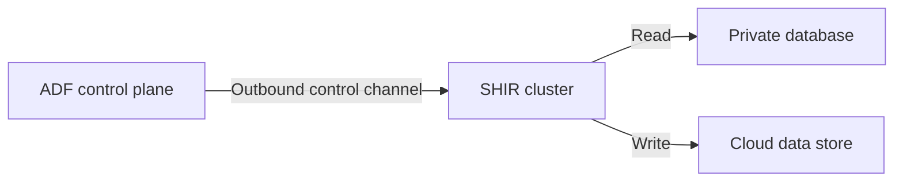

# Why Does ADF Need a Machine in the Middle?

## The Situation

An Azure Data Factory pipeline must copy data from a private database. The database team will not expose it to the internet, yet ADF is a managed cloud service. The proposed design installs a Self-hosted Integration Runtime on a VM that can reach the database.

Why is that machine necessary, and what happens when it fails?

## Why It Is Not Simple

ADF primarily orchestrates work. It stores pipeline definitions, schedules activities, and monitors runs, but the integration runtime performs data movement.

The SHIR initiates outbound connections, commonly HTTPS over TCP `443`, to required Azure services. In most setups, no inbound firewall opening from ADF to the VM is required.

## Build the Mental Model

The **Azure Integration Runtime** is Microsoft-hosted and is a good fit for cloud-to-cloud movement through reachable endpoints. The **Self-hosted Integration Runtime (SHIR)** is customer-hosted on Azure VMs or on-premises. It is used for private sources, restricted networks, or custom drivers.

SHIR is an execution agent, not persistent storage. It can use temporary disk while transferring data, but a durable landing zone must be elsewhere.

Multiple SHIR nodes provide availability and can increase concurrency. More nodes do not guarantee proportional throughput: the source database, sink, network, activity settings, or service quotas may become the bottleneck. If one node fails, healthy nodes can continue to accept work in a properly configured cluster.

An Azure **VM extension** performs post-deployment configuration such as installing an agent, running a script, or applying guest configuration. Examples include Azure Monitor Agent, Dependency Agent, Custom Script, Antimalware, Key Vault, and Guest Configuration extensions. Log Analytics is a workspace service; an agent or extension sends telemetry to it.

## Investigate the Problem

When a SHIR pipeline cannot connect:

1. Confirm the failing activity is assigned to the intended runtime.
2. Check node status, CPU, memory, disk, concurrency, and recent changes.
3. Resolve and test the source hostname from a SHIR node.
4. Check source firewall rules and the service account's permissions.
5. Confirm outbound access to required Azure endpoints.
6. Compare transfer metrics at the source, SHIR, network, and sink.

## Choose a Solution

Use Azure IR for reachable cloud endpoints and SHIR when the data path must originate inside a controlled network. Deploy at least two SHIR nodes when availability matters. Scale only after measurements show the runtime is the bottleneck, and automate node configuration so replacements are consistent.

Related reading: [Why Can My Laptop Connect but the Pipeline Cannot?](02-laptop-connects-pipeline-cannot.md) provides the connectivity checklist; [The Pipeline Is Slow Only During Peak Hours](11-peak-hour-pipeline-performance.md) covers runtime bottlenecks.

## Production Checklist

- Select the runtime based on the required network path and drivers.
- Permit required outbound endpoints without unnecessary inbound access.
- Use multiple nodes where availability is required.
- Monitor node health, capacity, queues, and transfer rates.
- Keep runtime versions and drivers consistent.
- Automate VM configuration and test node replacement.
- Keep durable data outside SHIR.

## Interview Takeaways

- ADF is primarily an orchestration and data-integration service.
- The integration runtime performs the data-plane transfer.
- Azure IR is Microsoft-hosted; SHIR is customer-hosted.
- SHIR can run on Azure VMs or on-premises and commonly requires outbound TCP `443`.
- Adding nodes can improve availability and concurrency, but upstream and downstream limits still apply.
- VM extensions configure or monitor VMs; Log Analytics is the destination workspace, not an extension.

## Official References

- [Integration runtime in Azure Data Factory](https://learn.microsoft.com/azure/data-factory/concepts-integration-runtime)
- [Create and configure a self-hosted integration runtime](https://learn.microsoft.com/azure/data-factory/create-self-hosted-integration-runtime)
- [Azure virtual machine extensions and features](https://learn.microsoft.com/azure/virtual-machines/extensions/overview)
