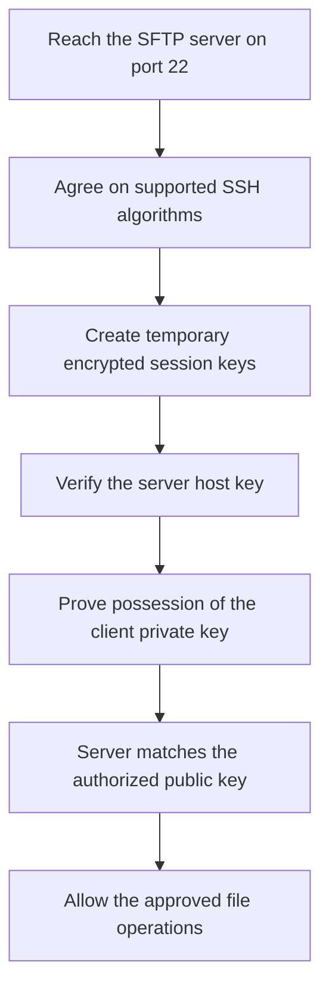

# The SFTP Feed Broke After Key Rotation

## The Situation

A retail company receives a sales file from a business partner every night. The partner places the file on an SFTP server, and an ingestion pipeline connects to that server, downloads the file, and stores it in the company's data platform.

The pipeline does not sign in with a password. Instead, it uses an SSH key pair. The ingestion team keeps the private key secret, and the partner stores the matching public key on the SFTP server. When the pipeline connects, it proves that it possesses the private key without sending that private key to the partner.

The company's security policy requires keys to be replaced regularly. The ingestion team creates a new key pair, updates the pipeline to use the new private key, and asks the partner to install the new public key. That night, the pipeline fails before downloading the file.

The network team confirms that the pipeline server can reach the SFTP server on port `22`. This proves that the request can reach the server, but it does not prove that the secure connection or sign-in process succeeds. Someone suggests switching back to the old private key, but the team first needs to understand which part of the connection failed.

Did the partner install the wrong public key? Is the pipeline still loading the old private key from its protected secret-storage service? Does the older SFTP server reject the new key type? Did the server itself change its identity? These failures can look similar from the pipeline even though they have different causes.

## Why It Is Not Simple

People often describe an SFTP connection as simply "using a key instead of a password." In reality, several separate checks occur before any file moves.

First, the client and server must be able to reach each other over the network. Next, they must agree on security methods they both support. The client must confirm that it is talking to the expected server. Finally, the server must confirm that the client is allowed to sign in.

```mermaid
sequenceDiagram
  participant P as Ingestion pipeline
  participant S as Partner SFTP server
  P->>S: Connect to the server on port 22
  P<->>S: Agree on supported security methods
  S->>P: Prove the server's identity with its host key
  P->>P: Check that this is the expected server
  P->>S: Prove possession of the client private key
  S->>S: Check the matching authorized public key
  S->>P: Allow file access
```

The key rotation changes the client's sign-in key, but the failure can happen at any of these stages. A healthy port test checks only the first stage.

## Build the Mental Model

### SFTP Is File Transfer Built on SSH

**SFTP** stands for **SSH File Transfer Protocol**. It provides commands for listing folders, downloading files, uploading files, renaming files, and managing other file operations through a secure SSH connection.

**SSH**, or **Secure Shell**, is a protocol for creating an encrypted connection to another computer and proving the identities involved. SSH is often used for remote command-line access, but SFTP uses the same secure foundation specifically for file operations.

SFTP commonly uses TCP port `22`. **TCP** is a common set of rules for creating a reliable connection between two systems. A port identifies the service a client wants to reach on a server. Successfully reaching port `22` means the server is available on the network. It does not mean the client has passed the SSH security checks or has permission to access files.

### SFTP, FTP, and FTPS Are Different Protocols

The similar names can cause confusion:

| Protocol | Plain-language meaning | How the connection is protected |
|----------|------------------------|---------------------------------|
| FTP | File Transfer Protocol, an older way to transfer files | Unencrypted unless another protection is added |
| FTPS | FTP protected by Transport Layer Security, or TLS | Uses TLS certificates to encrypt and verify the connection |
| SFTP | File transfer through SSH | Uses SSH encryption and SSH authentication |

TLS is the same broad security technology used by HTTPS websites. SFTP is not simply "secure FTP." It is a different protocol from FTP and FTPS. This matters when configuring firewalls, choosing connectors, and troubleshooting because the protocols use different connection behavior and security settings.

### Encryption Protects the Connection

**Encryption** changes readable information into a protected form that cannot be understood without the correct key. It prevents someone observing the network from reading the file contents, usernames, or other protected information.

SSH uses two broad types of encryption because they solve different problems:

- **Asymmetric encryption** uses a related pair of keys: one public key and one private key. It is useful for proving identity and securely establishing shared secrets, but it is relatively expensive for transferring large amounts of data.
- **Symmetric encryption** uses the same temporary secret key on both sides. It is fast and is used to protect the actual SSH session and file transfer.

When the connection begins, the client and server use a **key exchange** process to create shared temporary secrets without sending those secrets openly across the network. They then derive **session keys**, which are temporary symmetric keys used to encrypt that one connection.

The public/private key pair used to sign in is not normally used to encrypt every byte of the transferred file. It helps prove identity, while the temporary session keys efficiently protect the data transfer.

### A Key Pair Has a Public Half and a Private Half

An SSH **key pair** contains a public key and a private key that are mathematically related.

The **private key** must remain secret. The ingestion pipeline uses it to prove its identity. It should be stored in a protected secret-management system and should not be emailed or sent to the partner.

The **public key** can be shared. The partner installs it for the SFTP account that the pipeline will use. The server then accepts sign-in proof created by the matching private key.

The server does not need a copy of the client's private key. If the partner asks the ingestion team to send the private key, the process is incorrect and unsafe.

During rotation, creating the new pair is only the first step. The pipeline must receive the new private key, and the partner must install the matching public key for the correct account. If either side uses a key from a different pair, **authentication**, which is the process of proving identity, fails.

### The Server and Client Prove Different Identities

SSH normally uses at least two different kinds of key:

- A **host key** proves the identity of the SFTP server to the client.
- A **client key** proves the identity of the pipeline or user to the SFTP server.

The host key answers, "Is this really the partner's server?" The client key answers, "Is this really the approved ingestion pipeline?"

When the pipeline first connects, it should record or verify the partner server's host-key fingerprint through a trusted process. A **fingerprint** is a short value calculated from a public key that makes the key easier to compare. On later connections, the pipeline checks that the server still presents the expected host key.

This protects against a **man-in-the-middle attack**, where another system pretends to be the partner server and tries to intercept the connection.

Changing the client key should not require changing the host key. If the error says the host key is unknown or changed, the problem concerns the server's identity rather than the client's newly rotated sign-in key. The team should verify the change with the partner instead of automatically accepting it.

### The Server Must Authorize the Public Key

On many SSH servers, approved client public keys are stored in a file commonly named `authorized_keys` under the server user's account. This file tells the server which public keys may sign in as that user.

Installing the correct text is not always enough. SSH servers commonly reject the file if its ownership or permissions are unsafe, because another user might otherwise change the list of approved keys. A copied key can also fail because it was broken across lines, stored in an unsupported format, added to the wrong account, or pasted with missing characters.

This is why the statement "the partner installed the key" does not prove that the server can use it. The key must be the matching public key, installed correctly, and approved for the exact account used by the pipeline. After sign-in, the account must also be **authorized**, meaning it has permission to access the required folders and files.

### Key Algorithms Define How the Key Works

A **key algorithm** is the mathematical method used to create and use a key pair. Client and server must both support the chosen algorithm.

Common SSH key algorithms include:

| Algorithm | Practical meaning |
|-----------|-------------------|
| ED25519 | A modern, compact option commonly preferred when both systems support it |
| ECDSA | A modern key type designed to provide strong security with relatively small keys |
| RSA | A widely supported older key type that remains common for compatibility |
| DSA | An outdated key type that is disabled or rejected by modern systems |

ED25519 may fail against an older SFTP server because that server's SSH software or approved security policy does not support it. In that situation, the teams may need a supported RSA key while they plan a server upgrade. They should not fall back to DSA.

Some algorithms allow different key sizes. For example, the command `ssh-keygen -t rsa -b 2048` creates an RSA key pair and uses `-b 2048` to request a 2,048-bit key. A larger key size generally requires more work to attack, but approved company policy and current compatibility guidance should determine the required size.

### What Happens During an SSH Connection

The connection can now be understood as a sequence:



This sequence helps the team interpret errors. A timeout may point to the network. "No matching algorithm" points to compatibility. A host-key warning points to server verification. "Permission denied (publickey)" usually points to the client key or the server's approved-key configuration.

## Investigate the Problem

After a rotation failure, investigate in the same order as the connection:

1. Confirm that the server running the pipeline can reach the expected SFTP hostname and port `22`.
2. Read the exact error and identify whether it occurred while agreeing on security methods, verifying the server, proving the client's identity, or accessing files.
3. Confirm that the pipeline loads the intended new private key from the correct version in its protected secret-storage service.
4. Generate or inspect the public key from that private key and confirm that it matches the public key sent to the partner.
5. Confirm that the partner installed the public key for the exact server account used by the pipeline.
6. Check the server's `authorized_keys` file format, line breaks, ownership, and permissions.
7. Confirm that the client and server both support the selected key algorithm and size.
8. Confirm that the expected server host-key fingerprint has not changed unexpectedly.
9. Use detailed SSH connection logs to compare the last successful connection with the failed connection.

## Choose a Solution

Rotate keys with an overlap period so the old connection continues working while the new one is tested:

1. Create a new key pair and protect the new private key.
2. Send only the new public key to the partner through an approved process.
3. Ask the partner to add the new public key alongside the old public key.
4. Test the new private key from the real server that runs the ingestion before changing the scheduled pipeline.
5. Update the pipeline to use the new private key and monitor successful scheduled transfers.
6. Remove the old public key from the partner server and remove or disable access to the old private key.

This approach avoids a period where neither key works and provides a clear rollback path. Use a key algorithm supported by both organizations' approved security policies. Compatibility may require a temporary older option, but it should not become a reason to keep an unsafe algorithm indefinitely.

Related reading: [Encryption Worked, but Trust Failed](06-tls-trust-failed.md) explains certificate-based trust, while [Why Should Nobody Know the Production Password?](07-passwordless-production-access.md) covers secure private-key storage.

## Production Checklist

- Keep private keys in a protected secret-storage service and never send them to the partner.
- Record the owner, purpose, account, algorithm, fingerprint, and next rotation date.
- Verify server host-key fingerprints through a trusted process.
- Confirm which key algorithms and sizes both organizations support.
- Add the new public key before removing the old one.
- Test from the actual server and account used by the ingestion pipeline.
- Monitor successful scheduled transfers before removing the old key.
- Remove old keys and secret versions after the rotation is confirmed.

## Takeaways

- SFTP is a file-transfer protocol built on SSH and commonly uses port `22`.
- SFTP is different from FTP and FTPS.
- A successful port test proves that the server can be reached, not that SSH sign-in succeeds.
- The public key can be shared with the server; the private key must remain secret.
- The host key proves the server's identity, while the client key proves the pipeline's identity.
- SSH uses public-key methods to establish trust and temporary symmetric session keys to efficiently encrypt the connection.
- ED25519 may fail against older servers; RSA is often used for compatibility; DSA is outdated.
- A safe key rotation adds and tests the new key before removing the old key.

## Official References

- [RFC 4251: The Secure Shell Protocol Architecture](https://www.rfc-editor.org/rfc/rfc4251)
- [RFC 4253: SSH Transport Layer Protocol](https://www.rfc-editor.org/rfc/rfc4253)
- [OpenSSH key management](https://www.openssh.com/manual.html)
