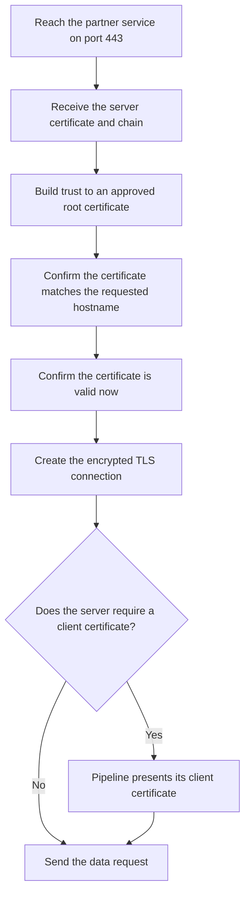
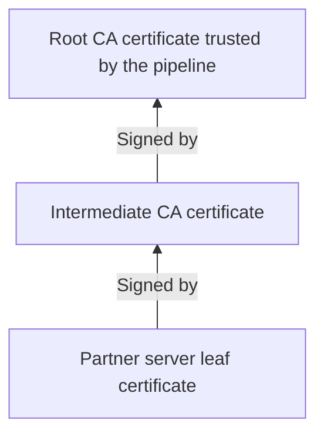

# Encryption Worked, but Trust Failed

## The Situation

A data team runs a pipeline that downloads order data from a partner's HTTPS service every hour. HTTPS means the connection is protected by Transport Layer Security, or TLS, which is the same security technology browsers use when connecting to websites.

The partner renews the service's security certificate before the old one expires. After the change, the service still works from a developer's laptop, but the production pipeline fails with a message containing `certificate unknown`. The network team confirms that the pipeline server can reach the partner on port `443`, which is the standard network port used by HTTPS, and the partner confirms that its service is running.

The partner says the new certificate is valid and the connection is encrypted. The data team installs a Certificate Authority chain on the pipeline server, but the connection still fails. Someone then asks whether the pipeline also needs its own client certificate.

Several different problems are now being mixed together. Can the pipeline reach the service? Does the pipeline trust the partner's certificate? Does the certificate describe the hostname the pipeline uses? Is the partner asking the pipeline to prove its own identity through mutual TLS?

Encryption can protect a connection only after the systems agree on how to create it and decide whether they trust the identities involved. A reachable port and a valid-looking certificate do not prove that every trust check succeeds.

## Why It Is Not Simple

People often think a certificate simply "turns on encryption." A certificate actually helps answer a different question: who is on the other side of the encrypted connection?

Before sending sensitive data, the pipeline needs to confirm that it is really talking to the partner's service rather than another system pretending to be that service. The certificate provides identity information, but the pipeline accepts it only when several checks succeed.



The failure can occur at any step. The text `certificate unknown` is not a complete diagnosis by itself. The team must identify which system reported it and which certificate or trust check that system rejected.

## Build the Mental Model

### TLS Protects Data While It Travels

**Transport Layer Security**, or **TLS**, is a protocol that creates an encrypted connection between two systems. Encryption changes readable information into a protected form so someone observing the network cannot understand it.

In this story, the pipeline is the **client** because it starts the connection, and the partner's HTTPS service is the **server** because it receives the connection. TLS protects the order data while it travels between them.

TLS also helps the client confirm the server's identity. Without that check, the pipeline could create an encrypted connection to the wrong system. The traffic would be encrypted, but it would be safely delivered to an attacker.

This is the important distinction: **encryption** protects the content of the connection, while **authentication** is the process of proving identity. A secure connection normally needs both.

### A Certificate Is a Digital Identity Document

A **digital certificate** is an electronic document that connects an identity to a public key. A server certificate normally includes:

- The hostnames the certificate is allowed to represent
- The public key belonging to the server
- The organization or Certificate Authority that issued it
- The date when it becomes valid and the date when it expires
- The purposes for which it may be used
- A digital signature from its issuer

The certificate contains the public key and can be shown to clients. The server keeps the matching private key secret. During the TLS connection, the server proves that it possesses that private key. This prevents another system from successfully using only a copied certificate.

A certificate does not remain valid forever. Expiration limits how long a lost or forgotten certificate can continue to be trusted and forces organizations to renew and review certificates regularly.

### Certificate Authorities Create a Chain of Trust

A **Certificate Authority**, usually shortened to **CA**, is an organization or internal service trusted to issue and sign certificates. Its digital signature allows clients to check that a certificate came from an approved issuer and was not changed after it was issued.

Trust is usually organized as a chain:

| Certificate type | Role in the chain | Typical handling |
|------------------|-------------------|------------------|
| Root CA certificate | The starting point that the client already trusts | Kept carefully in the client's trust store |
| Intermediate CA certificate | Connects the root to certificates issued for services or clients | Normally sent as part of the certificate chain |
| Leaf certificate | Identifies the actual server or client using the connection | Presented by that server or client |

A **root certificate** is the top-level trust point, sometimes called a **trust anchor**. It is usually self-signed, which means it signs itself rather than receiving a signature from another CA. The root is trusted because administrators or operating-system vendors deliberately placed it in the client's trusted certificate store.

Organizations usually avoid using a root CA directly for everyday certificate issuance. Instead, the root signs an **intermediate certificate**, and the intermediate CA signs server and client certificates. If an intermediate CA has a problem, it can be replaced without replacing the root trusted by every system.

The server's certificate is called a **leaf certificate** because it sits at the end of the chain. A server certificate and a client certificate are both leaf certificates; they differ in whose identity they represent and how they are allowed to be used.

### The Client Builds and Checks the Chain

When the pipeline connects, the partner server presents its leaf certificate and normally the required intermediate certificates. The pipeline follows the signatures from the leaf through the intermediates until it reaches a root certificate already stored in its **trust store**, which is the list of Certificate Authorities the pipeline server accepts.



The partner server normally does not need to send the root certificate because the client must already trust that root independently. Trusting any root supplied by an unknown server would allow that server to approve its own identity.

If the server forgets to send a required intermediate certificate, a developer's laptop may still work because it downloaded and saved a copy of that intermediate during an earlier connection. A clean production server may fail because it cannot build the same chain. This is one reason certificate problems can affect one machine but not another.

### The Certificate Must Match the Requested Hostname

Trusting the issuing CA is not enough. The pipeline must also confirm that the certificate was issued for the hostname it requested.

Certificates list approved hostnames in a field called **Subject Alternative Name**, commonly shortened to **SAN**. If the pipeline connects to `api.partner.example` but the certificate lists only `files.partner.example`, the identity check should fail even when both certificates were issued by a trusted CA.

This protects against using a valid certificate for one service to impersonate a different service.

Some servers host several HTTPS services behind the same IP address. **Server Name Indication**, or **SNI**, lets the client tell the server which hostname it wants during the start of the TLS connection. If the client sends the wrong hostname or does not support the required SNI behavior, the server may present the certificate for a different service.

### Ordinary TLS Usually Proves the Server's Identity

In a normal HTTPS connection, the server presents a certificate and the client validates it. This proves the server's identity to the client.

The client may later prove its own identity using another method, such as a password or an application access credential. That application-level sign-in is separate from the server-certificate check performed by TLS.

Installing the partner's CA chain on the pipeline Virtual Machine, or VM, allows that software-based server to trust certificates issued by the CA. It does not give the VM its own identity, because the VM still does not possess a client certificate and matching private key.

### Mutual TLS Makes Both Sides Present Certificates

**Mutual TLS**, usually shortened to **mTLS**, adds certificate-based client authentication to the normal TLS process. The server still presents its server certificate, and the client also presents a client certificate.

```mermaid
sequenceDiagram
  participant P as Pipeline client
  participant S as Partner server
  S->>P: Present server certificate
  P->>P: Validate server identity and trusted chain
  P->>S: Present client certificate and prove private-key possession
  S->>S: Validate client identity and trusted chain
  P<->>S: Continue through the encrypted connection
```

For mTLS to work, the pipeline needs a client certificate and its matching private key. The partner server must trust the CA that issued that client certificate and must allow the client identity represented by it.

mTLS solves a specific problem: it gives both systems strong machine identity at the TLS connection level. A random client cannot connect merely because it knows the server's address. However, mTLS adds work because both organizations must issue, store, renew, rotate, and remove certificates safely.

### Certificate Failures Often Look Similar

A certificate-related connection can fail because:

- The certificate has expired or is not valid yet
- The requested hostname does not appear in the certificate's SAN list
- The client does not trust the issuing root CA
- The server did not send a required intermediate certificate
- The server presents the wrong certificate because of SNI or configuration
- The server does not possess the private key matching its certificate
- An mTLS client does not send a client certificate
- The server does not trust or allow the client's certificate

The exact error message, the system that produced it, and the certificate actually presented during the failed connection are more useful than the general statement, "TLS is broken."

## Investigate the Problem

Investigate in the same order as the connection:

1. Confirm that the production pipeline server can reach the intended hostname and port.
2. Inspect the certificate actually presented during the failed connection rather than relying only on a certificate file sent by the partner.
3. Confirm that the certificate is currently valid and allowed for server authentication.
4. Confirm that the requested hostname appears in the certificate's SAN list.
5. Confirm that the server sends every required intermediate certificate.
6. Confirm that the pipeline server trusts the root CA at the end of the chain.
7. Confirm that the server possesses the private key matching its certificate.
8. If several services share the same address, confirm that SNI causes the correct certificate to be presented.
9. If mTLS is required, confirm that the pipeline presents the intended client certificate and proves possession of its private key.
10. Confirm that the partner trusts the CA that issued the client certificate and allows that client identity.

Compare the failing production connection with the successful laptop connection. Differences in trusted root certificates, previously saved intermediate certificates, hostnames, client certificates, and software versions often reveal why only one system fails.

## Choose a Solution

Manage certificates as shared production dependencies rather than one-time files:

1. Configure servers to present their leaf certificate and every required intermediate certificate.
2. Distribute trusted root certificates through controlled, repeatable configuration instead of manually changing individual machines.
3. Store private keys in protected systems and restrict who or what can use them.
4. Record certificate owners, hostnames, issuers, purposes, and expiration dates.
5. Alert owners well before expiration and test renewed certificates from real production clients before switching.
6. Keep an overlap or rollback plan during certificate rotation where the technology allows it.

Use ordinary TLS when the client needs to verify the server and another approved method handles client sign-in. Use mTLS when both systems must prove machine identity before the application request is accepted.

Do not add mTLS only because it sounds more secure. It improves machine authentication, but it also creates certificate issuance, secure private-key storage, renewal, rotation, removal, and troubleshooting responsibilities on both sides.

Related reading: [The SFTP Feed Broke After Key Rotation](05-sftp-key-rotation.md) explains SSH host and client keys, while [Why Should Nobody Know the Production Password?](07-passwordless-production-access.md) covers protected storage and workload identity.

## Takeaways

- TLS encrypts a connection and helps the client verify the server's identity.
- A certificate connects an identity and public key to a trusted issuer.
- A root certificate is the trusted starting point, intermediate CAs issue certificates, and leaf certificates identify actual servers or clients.
- The client must trust the chain, match the hostname, and confirm that the certificate is currently valid.
- Installing a CA chain lets a VM trust certificates; it does not give the VM a client identity.
- mTLS means both the client and server present certificates and validate each other.
- Certificate failures commonly involve expired certificates, hostname mismatches, missing intermediates, untrusted roots, incorrect SNI, or rejected client certificates.

## Official References

- [RFC 8446: The Transport Layer Security Protocol Version 1.3](https://www.rfc-editor.org/rfc/rfc8446)
- [Azure Certificate Overview](https://learn.microsoft.com/azure/security/fundamentals/certificate-overview)
- [Azure Key Vault certificates](https://learn.microsoft.com/azure/key-vault/certificates/about-certificates)
