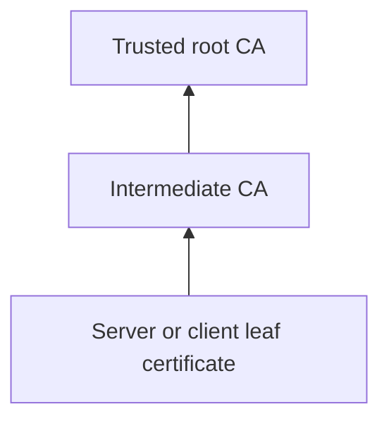

# Encryption Worked, but Trust Failed

## The Situation

A service is moved behind a new TLS certificate. Network tests succeed, but the ingestion runtime reports `certificate unknown`. Both teams say their systems support encryption, yet the connection still fails.

Encryption is only one part of the handshake. The client must also trust the server's identity, and mutual TLS may require the server to trust the client.

## Why It Is Not Simple

A certificate is useful only when its identity, signature chain, validity, usage, and private-key possession meet the receiving system's requirements.

The root is a self-signed trust anchor. An intermediate is signed by a root or another intermediate and usually issues leaf certificates. A server certificate identifies a server. A client certificate identifies a client.

## Build the Mental Model

A **Certificate Authority (CA)** certificate is trusted to sign or issue certificates. During TLS, the server presents a certificate and normally the intermediate chain. The client builds a path to a root already in its trust store and verifies the requested hostname against the certificate's Subject Alternative Names.

Installing a CA chain on a VM lets the VM validate certificates issued by that CA. It does not give the VM an identity. Client authentication requires a client certificate plus its private key, and the server must trust the CA that issued that client certificate.

In ordinary TLS, the client validates the server. In **mutual TLS (mTLS)**, both sides present and validate certificates. mTLS provides encrypted transport and strong client authentication without relying only on a shared password.

## Investigate the Problem

Use the error stage to narrow the cause:

1. Confirm the client reaches the intended host and port.
2. Inspect the certificate actually presented by the server.
3. Check validity dates and key usage.
4. Verify that the hostname appears in the certificate SAN.
5. Confirm the server sends required intermediate certificates.
6. Confirm the client trusts the root CA.
7. Check SNI when multiple services share one endpoint.
8. For mTLS, confirm the client sends the intended certificate and possesses its private key, then confirm the server trusts its issuer.

`certificate unknown` can indicate missing trust, a missing chain, an expired certificate, a hostname mismatch, incorrect SNI, or a rejected client certificate. The exact TLS alert and logs matter.

## Choose a Solution

Distribute trust anchors through managed configuration, not manual one-off changes. Configure servers to present the complete intermediate chain. Store private keys securely, automate renewal, and alert well before expiry.

Use mTLS when systems require strong machine identity at the transport layer. Do not add mTLS merely because it sounds more secure; it introduces certificate issuance, rotation, revocation, and troubleshooting work.

## Production Checklist

- Inventory certificates, owners, issuers, purposes, and expiry dates.
- Verify hostname, validity, chain, and key usage.
- Keep root trust controlled and intermediates complete.
- Prove that certificate and private key match.
- Test renewal and rotation before expiry.
- For mTLS, validate trust and identity in both directions.

## Interview Takeaways

- A root certificate is the trust anchor; intermediates issue leaf certificates.
- A client certificate is a leaf certificate used to authenticate a client.
- Trusting a CA does not provide a client identity.
- mTLS means both client and server present and validate certificates.
- TLS certificate failures commonly involve missing chains, untrusted CAs, hostname mismatch, expiry, or SNI.

## Official References

- [RFC 8446: The Transport Layer Security Protocol Version 1.3](https://www.rfc-editor.org/rfc/rfc8446)
- [Azure Certificate Overview](https://learn.microsoft.com/azure/security/fundamentals/certificate-overview)
- [Azure Key Vault certificates](https://learn.microsoft.com/azure/key-vault/certificates/about-certificates)
