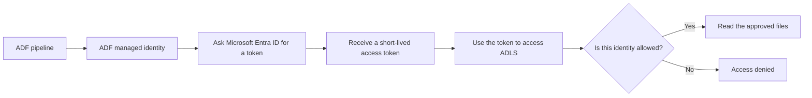

# Why Should Nobody Know the Production Password?

## The Situation

A data team is building an Azure Data Factory pipeline that reads vendor files from a production Azure Data Lake Storage account. ADLS is cloud storage commonly used for data lake folders and files. The pipeline works in the development environment, and now the team needs it to run in production.

The team asks the security team for the production storage password. In Azure Storage, this might really mean a storage account key, which can grant broad access to the storage account, a shared access signature, which is a signed URL-like token for limited access, a service-principal secret, which is a password for an application identity, or another password-like credential. The exact name changes by system, but the risk is the same: it is a secret value that can be copied and reused.

Security refuses to send the value to the ingestion team. At first, this feels like a delivery blocker. The pipeline needs to read files, so someone must know the credential and paste it into the pipeline, right?

Not necessarily. A better production design lets the workload prove who it is and receive temporary access without a human ever seeing a long-lived production secret. In Azure, that usually means using a managed identity and granting that identity only the permissions the pipeline needs.

This is the key idea: the application needs access, but the people building the application usually do not need to see the production secret.

## Why It Is Not Simple

Shared production credentials spread quickly. A value copied once into a chat message can later appear in pipeline parameters, deployment variables, support tickets, local test files, screenshots, and logs. Even when nobody means to be careless, secrets tend to travel.

Once a long-lived secret spreads, rotation becomes risky. If the security team replaces it, nobody may know every job, script, notebook, or test tool that still depends on the old value. If the secret is misused, audit logs may show only that the shared credential was used, not which person or workload actually used it.

Passwordless access does not mean the pipeline can do anything it wants. It means the pipeline uses its own identity to request access, and the platform checks whether that identity has permission.

The pipeline still needs permission. The difference is that the permission is attached to the workload's identity, not to a password that people copy around.

## Build the Mental Model

### Credentials, Secrets, Keys, and Certificates

A **credential** is information used to prove identity or gain access. A username and password is a familiar example. In cloud systems, credentials can also include access keys, client secrets, private keys, certificates, and temporary tokens.

A **secret** is a sensitive value that must not be exposed. Passwords, connection strings, storage account keys, and service-principal secrets are common examples. If another person or system gets the secret, they may be able to use it.

A **key** can mean different things depending on context. A storage account key is a powerful shared secret for accessing storage. A security key can also be used for encrypting data, signing data, or proving that data was not changed. The important question is always: what can someone do if they get this value?

A **certificate** is a digital identity document used by TLS, mTLS, and other security systems. It is often paired with a private key. Certificates are not passwords, but they still require controlled storage and rotation.

These values should not be hardcoded in notebooks, pipeline JSON, Terraform variables, or application code. Hardcoding means writing the secret directly into a file or configuration where it can be copied, committed, logged, or forgotten.

### Key Vault Is a Safe Place for Secrets, Not a Reason to Use More Secrets

**Azure Key Vault** is a managed Azure service for storing and controlling access to secrets, keys, and certificates. It provides access control, auditing, and integration with rotation processes.

Key Vault is useful when a system genuinely requires a secret. For example, an older partner system may support only a username and password, or an SFTP connection may require a private key. In that case, storing the value in Key Vault is much safer than hardcoding it in a pipeline.

However, Key Vault does not make a secret disappear. If the pipeline retrieves a password from Key Vault, that password still exists and still has to be rotated, protected, and audited. Key Vault reduces risk, but it is not as clean as avoiding a long-lived secret entirely.

The preferred order is usually:

| Approach | When to use it | Main risk |
|----------|----------------|-----------|
| Managed identity | Azure service supports identity-based access | Permissions must be scoped correctly |
| Key Vault secret | A legacy or external system requires a secret | A retrievable secret still exists |
| Hardcoded secret | Avoid in production | Secret spreads and becomes hard to rotate |

### Managed Identity Lets the Workload Prove Who It Is

A **managed identity** is an identity in Microsoft Entra ID that is attached to an Azure resource, such as ADF, an Azure VM, or an Azure Function. Microsoft Entra ID is Azure's identity system; it knows which users, groups, applications, and managed identities exist.

With managed identity, the pipeline does not store an ADLS password. Instead, ADF asks Entra ID for a **token**, which is a short-lived proof that ADF is acting as that managed identity. The storage account checks the token and decides whether that identity has permission.

This is similar to using a temporary badge instead of giving someone a master key. The badge is issued by a trusted authority, expires after a short time, and represents a specific identity.

When ADF accesses ADLS using managed identity, the credential is not stored in ADF. The identity exists in Entra ID, and tokens are issued when the pipeline runs. The data team grants permissions to that identity rather than pasting a password into the pipeline.

### System-Assigned and User-Assigned Managed Identities

Azure has two common types of managed identity:

| Type | What it means | Good fit |
|------|---------------|----------|
| System-assigned managed identity | Created for one Azure resource and deleted when that resource is deleted | One service needs its own identity |
| User-assigned managed identity | Created as a separate Azure resource and attached to one or more services | Several resources need to share the same workload identity |

A system-assigned identity is simple because it belongs to one resource. If the production ADF has its own system-assigned identity, audit logs can clearly show that production ADF accessed the storage account.

A user-assigned identity can be useful when multiple resources must act as the same workload. For example, a pipeline and a supporting compute job may both need to read the same landing folder. The tradeoff is that sharing one identity can make it harder to tell which resource performed an action unless logs provide enough detail.

The decision should follow ownership and audit needs. Do not share one identity across many unrelated workloads merely because it reduces setup.

### RBAC Grants Roles at a Scope

**Role-Based Access Control**, usually shortened to **RBAC**, grants permissions by assigning roles to identities. A role is a bundle of allowed actions, and a **scope** is the boundary where those actions apply.

Common scopes include a subscription, resource group, storage account, container, or other Azure resource. A broad scope gives access to more things. A narrow scope limits the damage if the identity is misused.

For storage, examples of data-access roles include **Storage Blob Data Reader** and **Storage Blob Data Contributor**. A reader can read data. A contributor can read, write, and delete data. The correct choice depends on what the pipeline actually needs.

In this story, a pipeline that only reads vendor files should not receive broad contributor access to the whole storage account if it needs only read access to one container or folder.

### ACLs Control Access Inside the Data Lake

Azure Data Lake Storage can also use **Access Control Lists**, usually shortened to **ACLs**. An ACL is a list of permissions on a filesystem path, such as a folder or file.

RBAC answers a broad Azure question: does this identity have a role that allows data operations at this scope? ACLs answer a more specific data-lake question: does this identity have permission on this folder or file path?

A workload may need both. For example, the managed identity may have a storage data role on the account or container, but still fail because it lacks execute permission on a parent folder or read permission on the target folder.

This explains a common confusion: "We granted the role, so why is access denied?" The answer may be that the data-lake path permissions still block the identity.

### Least Privilege Keeps Access Small on Purpose

**Least privilege** means granting only the permissions needed for the task, at the narrowest practical scope, for only as long as needed.

For this pipeline, least privilege might mean:

- Production ADF gets read access only to the incoming vendor folder.
- Development ADF does not get access to production data.
- Humans do not receive routine access to view production secret values.
- Write or delete permissions are granted only if the pipeline needs them.
- Temporary emergency access expires and is reviewed afterward.

Least privilege can feel slower during setup because the first permission request must be precise. In production, it makes incidents smaller and investigations clearer.

### Break-Glass Access Is for Emergencies

**Break-glass access** is emergency access used when normal access paths are unavailable and a production issue must be handled quickly. The name comes from the idea of breaking glass to reach emergency equipment.

Break-glass access should be rare, temporary, approved, audited, and reviewed. It should not become the normal way for engineers to view production passwords or manually repair access problems.

If a person truly needs to view or use a production secret during an incident, the organization should record who approved it, who used it, when it was used, why it was needed, and what follow-up rotation or cleanup is required.

## Investigate the Problem

When identity-based access fails, investigate the identity and permission path:

1. Confirm which identity the pipeline actually uses. Development ADF, production ADF, and a linked compute service may each have different identities.
2. Confirm that the pipeline requests a token for the correct service, such as ADLS rather than another Azure service.
3. Confirm that the identity has the required RBAC role at the correct scope.
4. Allow for permission propagation time, because new role assignments may take a short time to become effective.
5. Check ACLs on the target folder and parent folders if the storage account uses data-lake path permissions.
6. Verify network access separately. A private endpoint, firewall rule, or DNS issue can look like an access problem.
7. Review audit logs to see which identity was denied and which operation it attempted.
8. Confirm that humans are not using a different credential during manual tests, because that can hide the workload's missing permissions.

## Choose a Solution

Choose the access pattern by asking whether the target system supports identity-based access:

| Situation | Better starting choice | Why |
|-----------|------------------------|-----|
| ADF reads from ADLS | Managed identity | No storage password needs to be stored in ADF |
| A legacy database requires username and password | Key Vault secret | The secret exists, but storage and access are controlled |
| An SFTP partner requires a private key | Key Vault secret or certificate store | The private key must be protected and rotated |
| A service requires client certificates | Key Vault certificate or managed certificate process | Certificate and private key lifecycle must be controlled |

Prefer managed identity when both services support it. Use Key Vault when a secret, private key, or certificate is unavoidable. Give the workload permission to retrieve only its required value, automate rotation, and avoid granting routine human read access.

Related reading: [The SFTP Feed Broke After Key Rotation](05-sftp-key-rotation.md) and [Encryption Worked, but Trust Failed](06-tls-trust-failed.md) show why keys and certificates still need controlled lifecycle management.

## Production Checklist

- Prefer managed identity over stored credentials when the target service supports it.
- Use separate identities for development, test, and production.
- Grant roles at the narrowest practical scope.
- Check both RBAC roles and data-lake ACLs when ADLS access fails.
- Store unavoidable secrets, keys, and certificates in Key Vault or another approved managed store.
- Avoid routine human read access to production secret values.
- Automate rotation and test consumers before removing old credentials.
- Audit access and define a controlled break-glass process.

## Takeaways

- A production workload can access data without humans seeing a production password.
- Key Vault stores secrets, keys, and certificates with access control and auditing, but a retrievable secret still exists.
- Managed identities let Azure resources request short-lived tokens without stored credentials.
- A system-assigned managed identity belongs to one resource; a user-assigned managed identity is separate and can be attached to multiple resources.
- RBAC grants roles to identities at scopes such as a resource group, storage account, or container.
- ACLs control permissions on specific data-lake folders and files.
- Least privilege means giving only the access needed, at the narrowest useful scope.
- ADF using managed identity to access ADLS does not store an ADLS password.

## Official References

- [Azure Key Vault overview](https://learn.microsoft.com/azure/key-vault/general/overview)
- [Managed identities for Azure resources](https://learn.microsoft.com/entra/identity/managed-identities-azure-resources/overview)
- [Azure role-based access control](https://learn.microsoft.com/azure/role-based-access-control/overview)
- [Access control lists in Azure Data Lake Storage](https://learn.microsoft.com/azure/storage/blobs/data-lake-storage-access-control)
