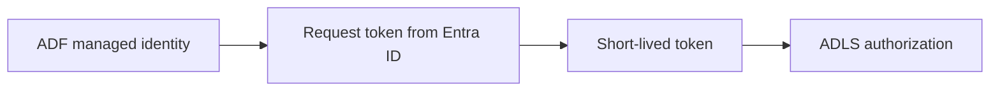

# Why Should Nobody Know the Production Password?

## The Situation

An ingestion team asks for the production storage password so ADF can load files. Security refuses. The team initially sees this as a delivery blocker: how can an application connect without somebody configuring a credential?

The better design is for the workload to prove its identity and receive short-lived access without a stored password.

## Why It Is Not Simple

Shared production credentials spread quickly. They appear in pipeline parameters, deployment variables, support messages, local test files, and logs. Rotation becomes risky because nobody knows every consumer. Human access also makes it difficult to prove which workload used the credential.

Passwordless does not mean permissionless:

## Build the Mental Model

Azure Key Vault stores and controls access to **secrets** such as passwords, **keys** used for cryptographic operations, and **certificates** used for TLS or mTLS. It adds access policies or RBAC, auditing, and rotation support. It is preferable to hardcoding, but a retrievable secret still exists.

A **managed identity** is an identity in Microsoft Entra ID managed for an Azure resource. The resource requests tokens at runtime; there is no application password stored in ADF.

A **system-assigned managed identity** is tied to one resource and is deleted with it. A **user-assigned managed identity** has an independent lifecycle and can be attached to multiple resources. Sharing one can simplify access, but it can also make attribution and least privilege harder.

**RBAC** assigns roles to identities at scopes such as subscription, resource group, or resource. **ACLs** grant data-level access to objects or paths, such as directories in a data lake. A workload may need both an appropriate role and path permissions.

**Least privilege** means granting only the required actions, at the narrowest scope, for the shortest practical time. Humans generally should not see production secret values. Exceptional break-glass access should be temporary, approved, audited, and reviewed.

## Investigate the Problem

When identity-based access fails:

1. Confirm which identity the workload actually uses.
2. Confirm the token is requested for the correct service.
3. Check RBAC role, scope, and propagation time.
4. Check data-plane ACLs on the target path.
5. Verify network access separately from authorization.
6. Review audit logs for the denied identity and operation.

## Choose a Solution

Prefer managed identity when both services support it. Use Key Vault when a legacy system requires a password, private key, or certificate. Give the workload permission to retrieve only its required value, automate rotation, and avoid granting routine human read access.

Related reading: [The SFTP Feed Broke After Key Rotation](05-sftp-key-rotation.md) and [Encryption Worked, but Trust Failed](06-tls-trust-failed.md) show why keys and certificates still need controlled lifecycle management.

## Production Checklist

- Prefer workload identity over stored credentials.
- Separate identities by environment and responsibility.
- Scope RBAC and ACLs narrowly.
- Store unavoidable secrets, keys, and certificates in a managed vault.
- Automate rotation and test consumers before revocation.
- Audit access and define a controlled break-glass process.

## Interview Takeaways

- Key Vault stores secrets, keys, and certificates with access control and auditing.
- Managed identities let Azure resources request tokens without stored credentials.
- System-assigned identities follow one resource's lifecycle; user-assigned identities are independent and reusable.
- RBAC governs role-based permissions at scopes; ACLs commonly govern data-object or path access.
- ADF using managed identity does not store an ADLS password.

## Official References

- [Azure Key Vault overview](https://learn.microsoft.com/azure/key-vault/general/overview)
- [Managed identities for Azure resources](https://learn.microsoft.com/entra/identity/managed-identities-azure-resources/overview)
- [Azure role-based access control](https://learn.microsoft.com/azure/role-based-access-control/overview)
- [Access control lists in Azure Data Lake Storage](https://learn.microsoft.com/azure/storage/blobs/data-lake-storage-access-control)
