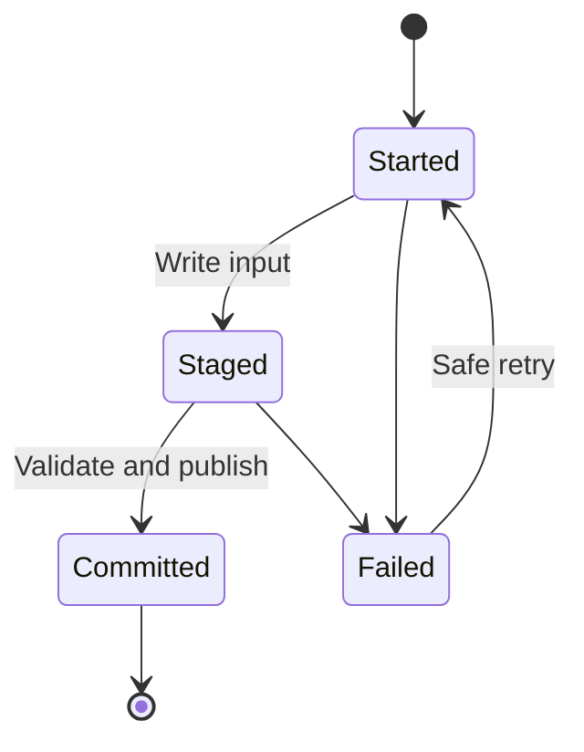

# Yesterday's Data Was Loaded Twice

## The Situation

A nightly pipeline copies orders into a warehouse. It writes half the rows, then loses its connection and fails. The orchestrator retries the activity, the second attempt succeeds, and the business finds duplicate orders the next morning.

Every activity is green on the final run. The data is still wrong.

## Why It Is Not Simple

**Orchestration** coordinates tasks, dependencies, schedules, retries, and failure handling. A workflow is often represented as a **directed acyclic graph (DAG)**: tasks flow in one direction without circular dependencies.

Retries improve availability only when repeated work is safe. An **idempotent** pipeline can process the same input again without changing the correct final result.

## Build the Mental Model

A **control table** records ingestion state such as source, run ID, input identifier, watermark, start and finish times, status, row counts, and error details. A file manifest is a specialized control record showing which files have been processed.

Partial failure is dangerous when the sink exposes incomplete output or when the checkpoint advances before the output is durable. Safer patterns include:

- Write to staging, validate, then atomically publish.
- Use a business key and `MERGE` or upsert instead of blind append.
- Replace one known partition rather than appending it again.
- Record immutable input identifiers and reject already committed inputs.
- Use transactions where the target supports them.

Deduplication after the event is useful protection, but it should not be the only control. It may hide upstream defects and can choose the wrong record when no reliable key or event order exists.

## Investigate the Problem

Reconstruct the incident before deleting data:

1. Identify every run and retry that touched the affected period.
2. Compare source inputs, row counts, partition paths, and sink commits.
3. Check when the control-table state or watermark advanced.
4. Determine whether the first attempt wrote visible partial output.
5. Identify the stable business key or source event identifier.
6. Repair the affected data and prove the corrected pipeline can replay it.

## Choose a Solution

Use append only when every input is unique and duplicate detection is strong. Use upserts when source records have stable keys and changes must be applied. Use partition replacement for self-contained time slices. Use staging and atomic promotion when consumers must never see partial results.

Reruns and backfills should use the same guarded path as scheduled processing, not a special script that bypasses control state.

Related reading: [The Daily Full Load No Longer Finishes Before Morning](09-full-load-no-longer-finishes.md) explains safe watermark advancement.

## Production Checklist

- Define the unit of work and its stable identifier.
- Record started, failed, and committed states.
- Advance checkpoints only after durable publication.
- Make retries, reruns, and backfills idempotent.
- Prevent consumers from seeing partial output.
- Reconcile source and sink counts and important business totals.
- Document repair and replay procedures.

## Interview Takeaways

- Orchestration coordinates a DAG's tasks, dependencies, retries, and failures.
- Idempotency means rerunning produces the same correct final state.
- Partial failures require checkpoints plus a strategy for partial writes.
- Watermarks, manifests, stable keys, upserts, and partition replacement help prevent duplicate ingestion.
- A successful pipeline run does not prove the data is complete or correct.

## Official References

- [Azure Data Factory pipeline failure handling](https://learn.microsoft.com/azure/data-factory/tutorial-pipeline-failure-error-handling)
- [Delta Lake merge documentation](https://docs.delta.io/latest/delta-update.html)
- [Databricks idempotent table writes](https://docs.databricks.com/aws/en/delta/idempotent-writes)
