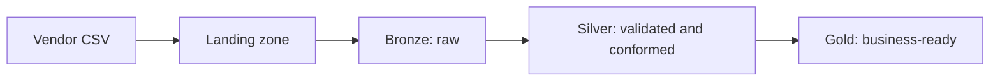

# The Raw File Arrived, but Is It Ready for Analytics?

## The Situation

A vendor sends a daily CSV file. One morning it adds a column, changes an identifier from numeric to text, and leaves several dates blank. The copy activity succeeds, but a dashboard later reports fewer customers than expected.

Moving a file successfully is not the same as producing trustworthy data.

## Why It Is Not Simple

Source data serves as evidence of what arrived. Analytics data serves a defined business meaning. Trying to make one dataset perform both roles makes recovery difficult and lets source quirks leak into reports.

## Build the Mental Model

A **landing zone** is the first durable location for received data. It is normally immutable, access-controlled, and organized so an input can be traced and replayed.

In a Bronze/Silver/Gold design:

- **Bronze** preserves raw records and ingestion metadata.
- **Silver** validates types, handles duplicates, and conforms definitions.
- **Gold** presents curated business datasets and aggregates.

**ETL** transforms before loading into the target. **ELT** loads raw data first and transforms it in the target platform. ELT often improves traceability because the original input remains available, but sensitive data still requires controls on arrival.

**Schema drift** is an unexpected addition, removal, rename, or type change. Strict handling can stop ingestion and protect consumers. Permissive handling can preserve new fields for later processing, but may silently introduce nulls or incorrect casts. A mature design lands the input, quarantines invalid records when appropriate, and alerts on incompatible changes.

CSV is row-oriented text with weak typing and limited metadata. Parquet is a typed, compressed columnar format with statistics. Analytics queries often read only a few columns, so columnar storage reduces I/O and supports predicate pushdown.

**Partitioning** physically groups data, often by date, so engines can skip irrelevant files and manage work in parallel. Over-partitioning creates many small files and metadata overhead. High-cardinality fields such as customer ID are usually poor partition choices.

## Investigate the Problem

1. Compare the failing file with the last accepted schema.
2. Check parsing errors, nulls, rejected rows, and implicit casts.
3. Reconcile raw, validated, and published row counts.
4. Identify which business rule removed or changed records.
5. Confirm downstream consumers use the intended curated layer.
6. Replay the preserved raw input after correcting the rule.

## Choose a Solution

Keep raw inputs immutable and attach source, arrival time, checksum, and run metadata. Define explicit contracts for curated data. Allow compatible schema additions only where consumers can tolerate them; quarantine or stop on incompatible changes. Convert frequently queried analytical data to a typed columnar format and partition according to real query patterns.

## Production Checklist

- Preserve original inputs and ingestion metadata.
- Define owners and contracts for curated datasets.
- Detect and classify schema changes.
- Quarantine invalid records without hiding them.
- Reconcile counts and key business measures between layers.
- Choose formats and partitions from access patterns.
- Test replay from raw data.

## Interview Takeaways

- ETL transforms before loading; ELT loads raw data before transforming.
- A landing zone preserves the first durable copy for traceability and replay.
- Bronze is raw, Silver is cleaned and conformed, and Gold is business-ready.
- Schema drift can break ingestion or silently corrupt results.
- Parquet is typed, compressed, and columnar; CSV is row-based text.
- Columnar formats reduce I/O when queries read a subset of columns.
- Partitioning improves pruning and parallelism when chosen carefully.

## Official References

- [Azure Data Lake Storage introduction](https://learn.microsoft.com/azure/storage/blobs/data-lake-storage-introduction)
- [Medallion architecture](https://learn.microsoft.com/azure/databricks/lakehouse/medallion)
- [Apache Parquet documentation](https://parquet.apache.org/docs/)
