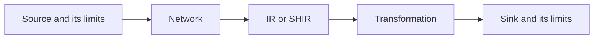

# The Pipeline Is Slow Only During Peak Hours

## The Situation

An ingestion pipeline normally finishes in twenty minutes. During peak hours it takes more than an hour and sometimes times out. A related Spark transformation occasionally runs out of memory. The first proposal is to add SHIR nodes and larger Spark executors.

Extra capacity may help, but it can also send more concurrent work to an already overloaded source.

## Why It Is Not Simple

Pipeline duration is the result of a chain of systems:

The slowest constrained stage determines throughput. Peak-only failures often point to resource contention, throttling, shared runtime CPU or memory, network saturation, service quotas, sink locks, or transient timeouts.

## Build the Mental Model

Concurrency can increase throughput while spare capacity exists. Beyond that point, it creates queues, retries, lock contention, and throttling. More SHIR nodes increase possible parallel activity execution, but do not increase the database's connection limit or the network's bandwidth.

Spark out-of-memory errors also have several causes:

- Too few partitions place too much data in each task.
- Data skew sends an unusually large key to one partition.
- Wide transformations create large shuffles.
- Caching retains datasets that are no longer useful.
- Drivers collect too much data.
- Executor memory or memory overhead is insufficient.

Increasing memory treats only the final symptom when poor partitioning or unbounded work is the cause.

## Investigate the Problem

Begin with a timeline and compare healthy and slow runs:

1. Check recent code, configuration, source-volume, and schema changes.
2. Measure source query latency and throttling.
3. Measure network throughput, packet loss, and proxy behavior.
4. Check IR or SHIR CPU, memory, queue time, node health, and concurrency.
5. Check sink latency, locks, quotas, and write rates.
6. Inspect retries and timeouts; they can amplify load.
7. In Spark UI, inspect stage duration, shuffle size, spill, skew, failed tasks, and executor loss.

Change one bottleneck-related variable at a time and compare evidence.

## Choose a Solution

- **Reduce work:** use incremental reads, predicate pushdown, pruning, and efficient formats.
- **Control work:** cap concurrency, add backoff, and move flexible workloads away from peak hours.
- **Scale out:** add runtime nodes or Spark executors when tasks parallelize and dependencies have capacity.
- **Scale up:** add memory or CPU when individual tasks legitimately require it.
- **Fix distribution:** repartition, address skewed keys, and reduce shuffle.

The durable solution often combines less work with controlled concurrency, rather than relying only on larger machines.

Related reading: [Why Does ADF Need a Machine in the Middle?](04-adf-machine-in-the-middle.md) explains SHIR capacity, and [The Daily Full Load No Longer Finishes Before Morning](09-full-load-no-longer-finishes.md) reduces avoidable data movement.

## Production Checklist

- Baseline stage-level latency, throughput, and capacity.
- Compare healthy and degraded runs.
- Check source, network, runtime, compute, and sink in order.
- Track retries, throttling, queues, and quotas.
- Load-test concurrency changes against dependency limits.
- Monitor Spark skew, shuffle, spill, and executor memory.
- Define alerts and a peak-hour operating plan.

## Interview Takeaways

- Investigate recent changes and metrics before scaling.
- Sudden ingestion slowdown can come from the source, network, runtime, sink, throttling, or retries.
- Peak-only failures commonly indicate contention or quotas.
- Spark OOMs commonly result from skew, too few partitions, shuffle growth, caching, or inadequate memory.
- More concurrency improves throughput only until a dependency reaches its limit.

## Official References

- [Monitor a self-hosted integration runtime](https://learn.microsoft.com/azure/data-factory/monitor-integration-runtime)
- [Azure Data Factory copy activity performance](https://learn.microsoft.com/azure/data-factory/copy-activity-performance)
- [Spark web UI](https://spark.apache.org/docs/latest/web-ui.html)
- [Spark performance tuning](https://spark.apache.org/docs/latest/sql-performance-tuning.html)
