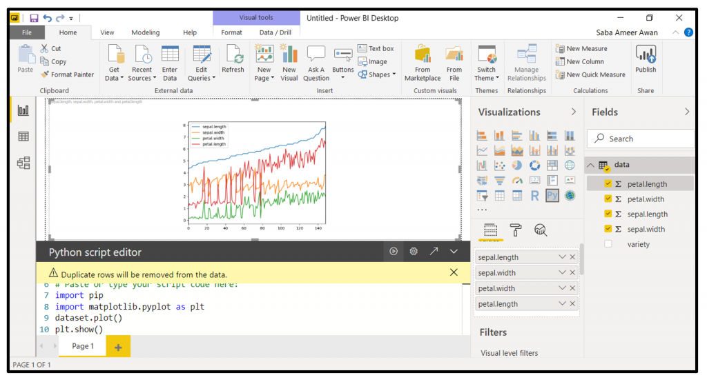

# Python Basics for BI: Bridging Excel, SQL, and Modern Data Analytics

If you’ve ever wondered why everyone in analytics is suddenly talking about Python, or felt unsure about how it fits between your trusty Excel sheets and complex SQL queries, this guide is for you. By the end, you’ll see exactly *why* Python unlocks a new level of power for BI analysts, no matter your starting point.



---

## 1. Why BI Needs Python Beyond Excel and SQL

Let’s be honest: Excel and SQL alone aren’t going anywhere. They’re the foundation of day-to-day BI work. But every analyst eventually runs into the same problems:

- **Excel gets overwhelmed fast.** Try working with millions of rows or repeating the same steps for a weekly report. Spreadsheets break, formulas get murky, and nothing is truly repeatable.
- **SQL is amazing for querying, limited for everything else.** Need to pull data from an API? Merge dozens of files? Build complex transformation pipelines or automate EDA (exploratory data analysis)? SQL alone can’t do it all.
- **Enter Python:** Python acts like the “glue” for all your analytical work. It connects databases, files, APIs, and analytical code, all in one script. It doesn’t replace Excel or SQL; it turbocharges them.

---

## 2. Where Does Python Fit in the BI Workflow?

Python isn’t just another tool, but it’s a Swiss Army knife for analysts. Here’s how it fits into real work:

- **Data Extraction:** Open CSVs, fetch web data, connect to APIs. Python handles all sources, no matter the size or format.
- **Data Transformation:** With libraries like Pandas, you can clean, join, filter, and shape your data at any scale, and unlike in Excel, every step is reproducible.
- **Analysis (EDA):** Slice and dice datasets programmatically, calculate KPIs and metrics, and ask “what if?” questions quickly, all inside Python.
- **Visualization:** Build everything from quick charts to interactive dashboards using libraries like matplotlib, seaborn, or plotly.
- **Automation:** Want your weekly dashboard to land in a stakeholder’s inbox every Monday morning, automatically? Python scripts make it happen.

---

## 3. Python & Pandas for BI: The Practical Cheat Sheet

You don’t need a CS degree! This is your consolidated, quick-start reference for the most essential Python _and_ Pandas operations you’ll use daily as a BI analyst, featuring real code and comments. Scan here for most tasks, from variables to repeatable analytics.

```python
# --- 1. CORE PYTHON BASICS ---

# Variables
revenue = 15000                  # integer
month = "January"                # string
cols = ["Date", "Revenue"]       # list

# Lists (like Excel columns)
sales = [120, 300, 450]
first_sale = sales[0]            # Access by index
sales.append(600)                # Add item

# Loop through a list
for amt in sales:
    print(amt)

# Dictionaries (like table rows)
row = {"Date": "2023-01-01", "Revenue": 200}
print(row["Revenue"])
row["Region"] = "West"           # Add new key-value

# Functions (reusable logic)
def total_revenue(sales_list):
    return sum(sales_list)
print(total_revenue([10, 20, 30]))

# Conditionals
amt = 2500
if amt > 1000:
    print("High value")
else:
    print("Normal value")

# --- 2. PANDAS: SUPERCHARGED DATA ANALYSIS ---

import pandas as pd

# Reading Data
df = pd.read_csv("sales.csv")        # Load a CSV as a DataFrame (table)
print(df.head())                     # Show top 5 rows

# Filtering Data
big_sales = df[df["Revenue"] > 10000]  # Rows with Revenue > 10,000
just_dates = df["Date"]                # Select a single column

# Aggregations
total = df["Revenue"].sum()                             # Sum column
region_summary = df.groupby("Region")["Revenue"].sum()  # Group/aggregate

# Writing Data
df.to_csv("output.csv", index=False)    # Save DataFrame to CSV

# Merging DataFrames (like SQL JOIN)
# Requires left_df and right_df with common 'ID' column
# df_all = pd.merge(left_df, right_df, on="ID", how="inner")

# --- 3. COMMON BI TASKS ---

# Loop through all CSV files in a folder
import os
for filename in os.listdir("data_folder"):
    if filename.endswith(".csv"):
        print(filename)
```

**Use this cheat sheet as your go-to Python & Pandas reference for BI analysis. Most loading, filtering, summarizing, and scripting tasks start here: combining the best of programming and “Excel++” workflows.**

Pandas, at the heart of much of this, is what lets Python quietly start replacing the repetitive pain points you face in BI: constantly exporting the same SQL queries, copy-pasting new CSVs, or rebuilding Excel pivots by hand.

Here’s why it matters beyond just “another tool”:

- **Rows and Columns:** Gives you the familiar feel of SQL tables and Excel sheets, but with far more power. Every transformation is captured in code and can be rerun, making your work truly repeatable.
- **Easy Transformations and Aggregations:** Clean, filter, pivot, merge, and summarize your data just like you would in Excel or SQL, but with one reproducible script instead of dozens of manual steps or exports.
- **Scalability:** Handles datasets that choke Excel or require multiple SQL extracts, to process tens of millions of rows smoothly, all in memory and fully scriptable.
- **Bridges Excel and SQL:** Rather than switching back and forth (and losing track of steps), Pandas lets you pull data directly from SQL, manipulate it like a pro, and automate what used to be manual Excel “workflows.”

*With Pandas, you don’t just analyze data. You automate and document your analytics process, freeing yourself from repetitive SQL exports and endless Excel formulas. Each step is repeatable and reliable, so your BI work scales with your needs.*

---

## 💡 Takeaway

Python isn’t here to wipe out Excel or SQL, but it’s here to fill in their gaps, automate your workflow, and let you analyze data *your way.* Once you’re comfortable with the essentials above, you’ll be equipped to tackle any BI task, from wrangling messy data to building powerful, automated insights.
